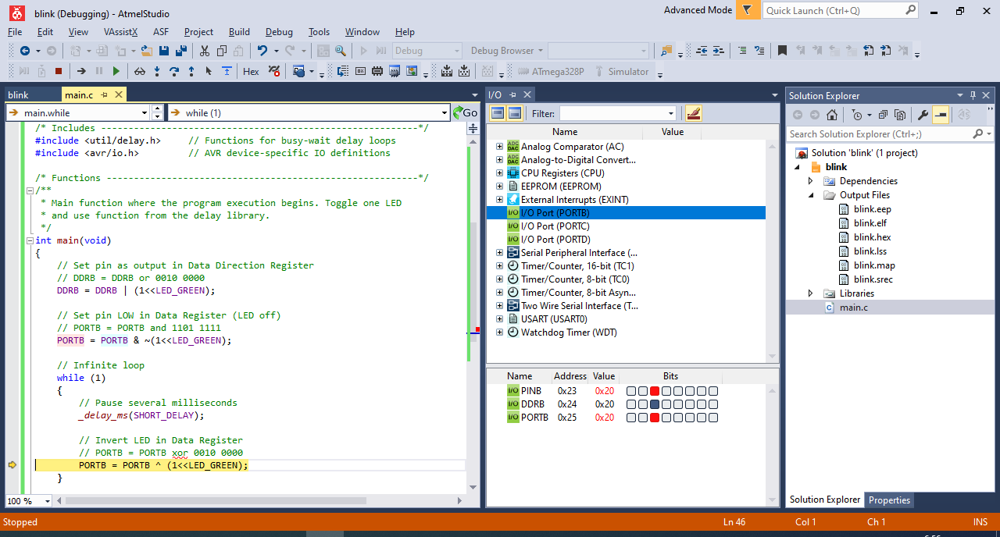
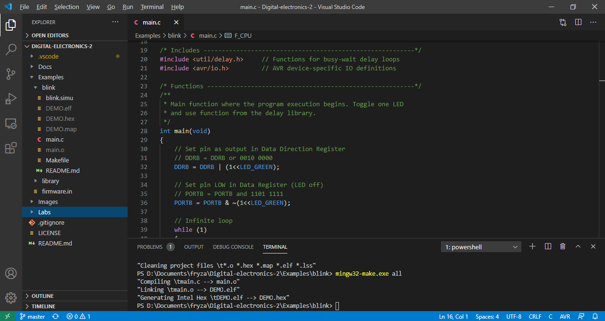
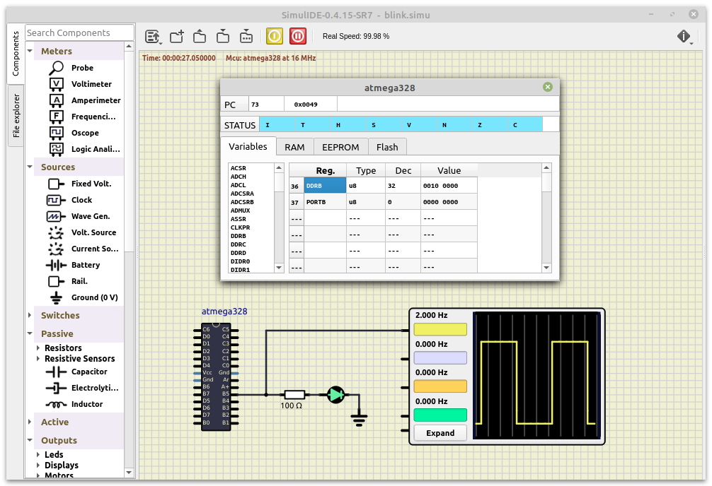
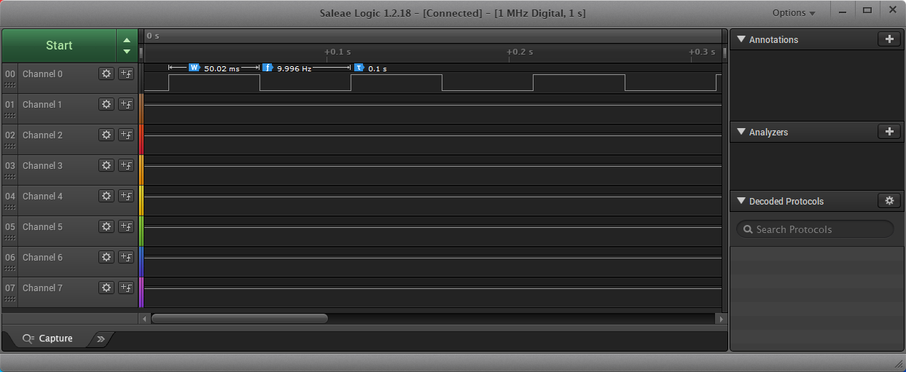
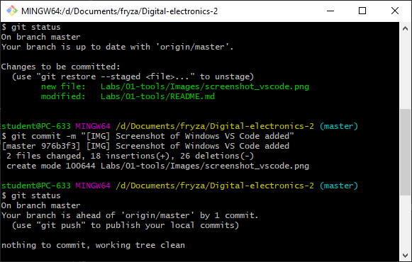

# Lab 1: Git version-control system, AVR tools

### Learning objectives

The purpose of this laboratory exercise is to learn how to use the git versioning system, write the markdown readme file, learn the basic structure of C code, and learn how to use development tools to program a microcontroller on the Arduino Uno board.




## Preparation tasks (done before the lab at home)

Create an account on [GitHub](https://github.com/).

According to your preferences, choose one of the variants below and prepare the development chain on your own computer.


### Windows and Atmel Studio 7

Download and install:
* [Atmel Studio 7](https://www.microchip.com/mplab/avr-support/atmel-studio-7),
* [SimulIDE](https://www.simulide.com/p/home.html), and
* [git](https://git-scm.com/).

If you have the option to use Arduino Uno board and logic analyzer, also download and install:
* [Arduino IDE](https://www.arduino.cc/en/Main/Software), which contains all USB drivers and
* [Saleae logic](https://www.saleae.com/downloads/).

To make it easier to work with git, you can install a graphical client:
* [GitKraken](https://www.gitkraken.com/) or
* [GitHub Desktop](https://desktop.github.com/).


### Windows and command-line toolchain

Follow the [instructions for Windows](https://github.com/tomas-fryza/Digital-electronics-2/blob/master/Docs/HOWTO_windows.md) and create an entire comand-line toolchain instead of using Atmel Studio.

Download and install [SimulIDE](https://www.simulide.com/p/home.html).

To make it easier to work with git, you can install a graphical client:
* [GitKraken](https://www.gitkraken.com/) or
* [GitHub Desktop](https://desktop.github.com/).


### Ubuntu-based Linux distributions

Follow the [instructions for Linux](https://github.com/tomas-fryza/Digital-electronics-2/blob/master/Docs/HOWTO_linux.md) and create an entire comand-line toolchain.

Download and install [SimulIDE](https://www.simulide.com/p/home.html).

To make it easier to work with git, you can install a graphical client [GitKraken](https://www.gitkraken.com/).


## Part 1: GitHub

GitHub is a code hosting platform for collaboration and version control. GitHub lets you (and others) work together on projects.

In GitHub, create a new public repository titled **Digital-electronics-2**. Initialize a README, .gitignore, and [MIT license](https://choosealicense.com/licenses/mit/).

Use one of the available git manuals, such as [1](https://medium.com/swlh/how-to-make-the-perfect-readme-md-on-github-92ed5771c061), [2](https://help.github.com/en/articles/basic-writing-and-formatting-syntax), or [3](https://guides.github.com/features/mastering-markdown/), and add the following sections to your README file.

 * Headers
 * Emphasis (italics, bold)
 * Lists (ordered, unordered)
 * Links
 * Table
 * Listing of C source code


## Part 2: Local repository

Run Git Bash (Windows) of Terminal (Linux) and create your own home folder inside `Documents`.

```bash
## Windows Git Bash:
$ cd d:/Documents/
$ mkdir your-name
$ cd your-name/

## Linux:
$ cd
$ cd Documents/
$ mkdir your-name
$ cd your-name/
```

With help of `git` command, clone a local copy of your public repository.

```bash
## Windows Git Bash or Linux:
$ git clone https://github.com/your-github-account/Digital-electronics-2
$ cd Digital-electronics-2/
$ ls
LICENSE  README.md
```

Download `Docs` and `Examples` folders from [this repository](https://github.com/tomas-fryza/Digital-electronics-2) and copy them to your `Digital-electronics-2` local repository.

```bash
## Windows Git Bash or Linux:
$ ls
Docs  Examples  LICENSE  README.md
```

Create a new working folder `Labs/01-tools` for this exercise.

```bash
## Windows Git Bash or Linux:
$ mkdir Labs
$ cd Labs/
$ mkdir 01-tools
```


## Part 3: Test AVR tools

### Version: Windows and Atmel Studio 7

Follow any online tutorial, such as [1](../../Docs/CProgrammingInAtmelStudio7.pdf) or [2](https://unboxing-tomorrow.com/programming-atmel-microcontrollers-with-atmel-studio-7/), create a new GCC C Executable Project for ATmega328P within `01-tools` working folder and copy/paste [blink example code](../../Examples/blink/main.c) to your `main.c` source file. Examine all lines of source code. What is the meaning of individual commands?

Compile the project.

Simulate the project in Atmel Studio 7.

Run external programmer in menu **Tools > Send to Arduino UNO** and download the compiled code to Arduino Uno board. Note that, this external tool is configured according to [How to Flash AVR from Atmel Studio](https://www.elecrom.com/program-flash-arduino-uno-atmel-studio/).


### Version: Windows and command-line toolchain

Copy `main.c` and `Makefile` files from blink example to `Labs\01-tools` folder.

Copy `Example\Makefile.in` settings file to `Labs` folder. Note that, this file contains parameters and settings that are identical for all (future) projects located in this folder. Uncomment the Windows settings in this file. Make sure the values for `PREFIX` and` AVRDUDE` contain the correct paths and `USBPORT` contains port where Arduino board is connected.

```Makefile
## Linux
#PREFIX  = /opt/avr8-gnu-toolchain-linux_x86_64
#AVRDUDE = avrdude
#RM      = rm -f
## See "dmesg" command output
#USBPORT = /dev/ttyUSB0

## Windows
PREFIX  = C:\APPZ\Atmel\Studio\7.0\toolchain\avr8\avr8-gnu-toolchain
AVRDUDE = C:\APPZ\avrdude\avrdude.exe
RM      = del
# See USB-SERIAL CH340 port in Device Manager
USBPORT = COM3
```

Run Visual Studio Code source code editor, open your `Digital-electronics-2` working folder, run internal terminal in menu **Terminal > New Terminal**, and change path to `Labs\01-tools`.

```bash
cd Labs\01-tools\
```

Open `main.c` source file. What is the meaning of each line of this source code?

Use the following commands step by step in the internal terminal to find out what they mean. Note: these commands are defined in `Makefile`.

```bash
mingw32-make.exe all
mingw32-make.exe clean
mingw32-make.exe size
mingw32-make.exe flash
```




### Version: Ubuntu-based Linux distributions

Copy `main.c` and `Makefile` files from blink example to `Labs/01-tools` folder.

Copy `Example/Makefile.in` settings file to `Labs` folder. Note that, this file contains parameters and settings that are identical for all (future) projects located in this folder. Uncomment the Linux settings in this file. Make sure the values for `PREFIX` and` AVRDUDE` contain the correct paths and `USBPORT` contains port where Arduino board is connected.

```Makefile
## Linux
PREFIX  = /opt/avr8-gnu-toolchain-linux_x86_64
AVRDUDE = avrdude
RM      = rm -f
# See "dmesg" command output
USBPORT = /dev/ttyUSB0

## Windows
#PREFIX  = C:\APPZ\Atmel\Studio\7.0\toolchain\avr8\avr8-gnu-toolchain
#AVRDUDE = C:\APPZ\avrdude\avrdude.exe
#RM      = del
## See USB-SERIAL CH340 port in Device Manager
#USBPORT = COM3
```

Run Visual Studio Code source code editor, open your `Digital-electronics-2` working folder, run internal terminal in menu **Terminal > New Terminal**, and change path to `Labs/01-tools`.

```bash
cd Labs/01-tools/
```

Open `main.c` source file. What is the meaning of each line of this source code?

Use the following commands step by step in the internal terminal to find out what they mean. Note: these commands are defined in `Makefile`.

```bash
$ make all
$ make clean
$ make size
$ make flash
```


## Part 4: SimulIDE

Run SimulIDE, use online [tutorials](https://www.simulide.com/p/blog-page.html), and create a circuit with ATmega328 AVR microcontroller.

All circuit and control elements are available in the **Components** tab. Use the following components ATmega328 (**Micro > AVR > atmega > atmega328**), resistor (**Passive > Resistor**), LED (**Outputs > Led**), and GND (**Sources > Ground (0 V)**) and connect them as shown.



Right-click on the ATmega package and select **Load firmware**. In your project folder, find the `*.hex` file that was created by compiling in the previous point.

Register values can be displayed in the **RamTable** tab. In the **Reg.** column, type `DDRB` on the first line and `PORTB` on the second.

Click to **Power Circuit** button, simulate the project, and monitor the LED status and register values. The simulation can be paused with the **Pause Simulation** button and stopped by pressing the **Power Circuit** button again.

You can connect a probe (**Meters > Probe**), an oscilloscope (**Meters > Oscope**), or a voltmeter (**Meters > Voltimeter**) to output B5 and observe the voltage.

The properties of each component can be found/changed in the **Properties** tab.


## Part 5: Logic analyzer

Run Saleae Logic software, use wire and connect Channel 0 to Arduino board pin 13 (pin PB5 is connected here), and verify the duration of delay function.

To start sampling, press the green button with two arrows, set the sampling rate to 1&nbsp;MS/s and the recording time to 1 second. Click the Start button.




## Synchronize repositories

When you finish working, always synchronize the contents of your working folder with the local and remote versions of your repository. This way you are sure that you will not lose any of your changes.

Use [git commands](https://github.com/tomas-fryza/Digital-electronics-2/wiki/Git-useful-commands) to add, commit, and push all local changes to your remote repository. Note that, a detailed description of all git commands can be found [here](https://github.com/joshnh/Git-Commands). Check the repository at GitHub web page for changes.


```bash
## Windows Git Bash or Linux:
$ git status
$ git add <your-modified-files>
$ git status
$ git commit -m "[LAB] AVR toolchain tested"
$ git status
$ git push
$ git status
```




## Experiments on your own

1. Choose one variant and install the AVR development tools on your computer.

2. Modify the code from `blink` example and build an application that will repeatedly displayed the string `DE2` on two LEDs in the Morse code. Choose the durations of the "dot" and "comma" so that they are visible during the simulation and/or implementation. Display a dot on one LED and a comma on the other.

3. Simulate the Morse code application in SimulIDE.


## Lab assignment

1. Submit the GitHub link to your `Digital-electronics-2` repository.

2. Blink example. Submit:
    * Answers to questions: What is the meaning of `|`, `&`, `^`, `~`, `<<`, `>>` binary operators? Write a truth table and explain the use of operators with examples.

3. Morse code application. Submit:
    * Listing of C code (`main.c`),
    * Screenshot of SimulIDE circuit.

The deadline for submitting the task is the day before the next laboratory exercise. Use [BUT e-learning](https://moodle.vutbr.cz/) web page and submit a single PDF file.
