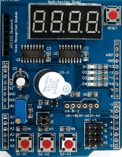

# Lab 4: Interrupts, Timers

#### Table of contents

1. [Lab prerequisites](#Lab-prerequisites)
2. [Hardware components](#Hardware-components)
3. [Synchronize Git and create a new project](#Synchronize-Git-and-create-a-new-project)
4. [Timers](#Timers)
5. [Clean project and synchronize git](#Clean-project-and-synchronize-git)
6. [Ideas for other tasks](#Ideas-for-other-tasks)


## Lab prerequisites

1. According to the [ATmega328P datasheet](https://www.microchip.com/wwwproducts/en/ATmega328p) what is the meaning of Timer/Counter prescaler block? By equation  where  is CPU clock frequency,  represents number of bits, and  is prescaler value, calculate overflow times for ATmega328P timers and complete the following table for all prescaler values.

    | **Module** | **Number of bits** | **1** | **8** | **32** | **64** | **128** | **256** | **1024** |
    | :-: | :-: | :-: | :-: | :-: | :-: | :-: | :-: | :-: |
    | Timer/Counter0 | 8 | 16u | 128u | -- | | -- | | |
    | Timer/Counter1 | 16 | | | -- | | -- | | |
    | Timer/Counter2 | 8 | | | | | | | |

    > Equations were generated by [Online LaTeX Equation Editor](https://www.codecogs.com/latex/eqneditor.php).
    >

2. See schematic of [Multi-function shield](../../Docs/arduino_shield.pdf) and find out the connection of D1, D2, D3, D4 LEDs and S1-A1, S2-A2, S3-A3 push buttons.


## Hardware components

1. [ATmega328P](https://www.microchip.com/wwwproducts/en/ATmega328P) 8-bit AVR microcontroller
2. [Arduino Uno](../../Docs/arduino_shield.pdf) board
3. [Multi-function shield](../../Docs/arduino_shield.pdf) with four LEDs, three push buttons, four seven-segment displays
4. 24MHz 8-channel [logic analyzer](https://www.saleae.com/)

&nbsp;



## Synchronize Git and create a new project

1. In Visual Studio Code editor (VS Code) open your Digital-electronics-2 working directory and [synchronize the contents](https://github.com/joshnh/Git-Commands) with GitHub.

    ```bash
    $ pwd
    /home/lab661/Documents/your-name/Digital-electronics-2
    $ git pull
    ```

2. Create a new folder `Labs/04-interrupts` and copy three files from the last project.

    ```bash
    $ cd Labs/
    $ mkdir 04-interrupts
    $ cp 03-gpio/main.c 03-gpio/Makefile 03-gpio/README.md 04-interrupts/
    $ cd 04-interrupts/
    $ ls
    main.c  Makefile  README.md
    ```


## Timers

*[Timer/Counter0](https://www.arnabkumardas.com/online-courses/avr-timer-counter-programming-tutorial-atmega328p-avr-8-bit-arduino-uno/) is a general purpose 8-bit Timer/Counter module, with two independent Output Compare Units, and with PWM support. It allows accurate program execution timing (event management) and wave generation.*

1. According to the [ATmega328P datasheet](https://www.microchip.com/wwwproducts/en/ATmega328p) which I/O registers and which bits configure the timer operations?

    | **Module** | **Operation** | **I/O register(s)** | **Bit(s)** |
    | :-: | :-- | :-: | :-: |
    | Timer/Counter0 | Prescaler value<br>Overflow interrupt enable<br>Data value | TCCR0B<br>TIMSK0<br>TCNT0 | CS02, CS01, CS00<br>TOIE0<br>TCNT0[7:0] |
    | Timer/Counter1 | Prescaler value<br>Overflow interrupt enable<br>Data value | | |
    | Timer/Counter2 | Prescaler value<br>Overflow interrupt enable<br>Data value | | |

2. Create a new library header file `library/Include/timer.h` and specify new *defines* for all three timers according to the following listing.

    ```C
    #ifndef TIMER_H_INCLUDED
    #define TIMER_H_INCLUDED

    #include <avr/io.h>

    /** @brief Defines prescaler values for Timer1.
     *  @note  F_CPU = 16 MHz */
    #define TIM1_stop()         TCCR1B &= ~(_BV(CS12) | _BV(CS11) | _BV(CS10));
    #define TIM1_overflow_4ms() TCCR1B &= ~(_BV(CS12) | _BV(CS11)); TCCR1B |= _BV(CS10);
    ...

    /** @brief Defines interrupt modes for Timer1. */
    #define TIM1_overflow_enable()  TIMSK1 |= _BV(TOIE1);
    #define TIM1_overflow_disable() TIMSK1 &= ~_BV(TOIE1);
    ...

    #endif /* TIMER_H_INCLUDED */
    ```

3. Program an application that toggles three LEDs from Multi-function shield using internal Timer0, Timer1, and Timer2 with different overflow times. Do not forget to include timer header file to your main application `#include "timer.h"`.

    To use interrupts in your application, you must:
    
    * insert the header file `#include <avr/interrupt.h>`,
    * define interrupt handlers such as `ISR(TIMER1_OVF_vect)`, and
    * allow such handlers to run by `sei()` macro.

4. Verify overflow times by the logic analyzer. To run the analyzer, type `Logic &` to VS Code terminal.


## Clean project and synchronize git

1. Remove all binaries and object files from the working directory by command

    ```bash
    $ make clean
    ```

2. Use `cd ..` command in VS Code terminal and change the working directory to `Digital-electronics-2`. Then use [git commands](https://github.com/joshnh/Git-Commands) to add, commit, and push all local changes to your remote repository. Check the repository at GitHub web page for changes.

    ```bash
    $ pwd
    /home/lab661/Documents/your-name/Digital-electronics-2/Labs/04-interrupts

    $ cd ..
    $ cd ..
    $ pwd
    /home/lab661/Documents/your-name/Digital-electronics-2

    $ git status
    $ git add <your-modified-files>
    $ git status
    $ git commit -m "[LAB] Creating 04-interrupts lab"
    $ git status
    $ git push
    $ git status
    ```


## Ideas for other tasks

1. Use the [ATmega328P datasheet](https://www.microchip.com/wwwproducts/en/ATmega328p) and configure Timer/Counter1 to generate a PWM (Pulse Width Modulation) signal on channel A (pin PB1, OC1A). Configure Fast PWM, 10-bit, and non-inverting mode to control a LED at pin PB1. Select the 64 clock prescaler. Increment the duty cycle when the timer overflows, ie each PWM signal period. Note: The 16-bit value of the output compare register pair OCR1AH:L is directly accessible using the OCR1A variable defined in the AVR Libc library.

2. Use basic [Goxygen commands](http://www.doxygen.nl/manual/docblocks.html#specialblock) inside C-code comments and prepare your `timer.h` library for easy PDF manual generation.

3. Create a new function using the external and timer interrupts to debounce a push button signal.
