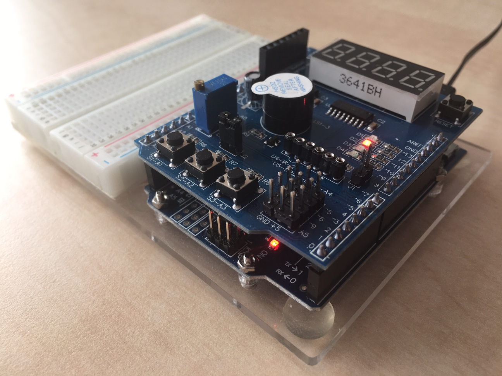

# Lab 4: Interrupts, timer

### Learning objectives

The purpose of the laboratory exercise is to understand the function of the interrupt, interrupt service routine, and the structure of the timer unit. Another goal is to master the search for information in the MCU manual; specifically setting the timer control registers.

## Preparation tasks (done before the lab at home)

Consider an n-bit number that we increment based on the clock signal. If we reach its maximum value and try to increment it, it will be reset. We call this state an overflow. The overflow time depends on the frequency of the clock signal, the number of bits, and on the value of the prescaler:

&nbsp;

&nbsp;

Calculate the overflow times for three Timer/Counter modules that contain ATmega328P if CPU clock frequency is 16&nbsp;MHz. Complete the following table for given 5 prescaler values. Note that, Timer/Counter2 is able to set 7 prescaler values, including 32 and 128.

| **Module** | **Number of bits** | **1** | **8** | **32** | **64** | **128** | **256** | **1024** |
| :-: | :-: | :-: | :-: | :-: | :-: | :-: | :-: | :-: |
| Timer/Counter0 | 8  | 16u | 128u | -- | | -- | | |
| Timer/Counter1 | 16 |     |      | -- | | -- | | |
| Timer/Counter2 | 8  |     |      |    | |    | | |

See schematic of [Multi-function shield](../../Docs/arduino_shield.pdf) and find out the connection of D1, D2, D3, D4 LEDs and S1-A1, S2-A2, S3-A3 push buttons.

&nbsp;

&nbsp;

&nbsp;

&nbsp;

&nbsp;

&nbsp;

## Part 1: Synchronize repositories and create a new folder

Run Git Bash (Windows) of Terminal (Linux) and synchronize local and remote repositories. Create a new working folder `Labs/04-interrupts` for this exercise.

## Part 2: Timers

A timer (or counter) is a hardware block built in the MCU. It is like a clock, and can be used to measure time events. ATmega328P microcontroller has three timers, called:
* Timer/Counter0,
* Timer/Counter1, and
* Timer/Counter2.

T/C0 and T/C2 are 8-bit timers, where T/C1 is a 16-bit timer.

Different clock sources can be selected for each timer independently using the CPU frequency pre-scaler values. The timer modules can be configured with several special purpose registers.

According to the [ATmega328P datasheet](https://www.microchip.com/wwwproducts/en/ATmega328p) which I/O registers and which bits configure the timer operations?

| **Module** | **Operation** | **I/O register(s)** | **Bit(s)** |
| :-: | :-- | :-: | :-: |
| Timer/Counter0 | Prescaler value Overflow interrupt enable Data value | TCCR0B TIMSK0 TCNT0 | CS02, CS01, CS00 TOIE0 TCNT0[7:0] |
| Timer/Counter1 | Prescaler value Overflow interrupt enable Data value | | |
| Timer/Counter2 | Prescaler value Overflow interrupt enable Data value | | |

### Version: Atmel Studio 7

Create a new GCC C Executable Project for ATmega328P within `04-interrupt` working folder and copy/paste [template code](main.c) to your `main.c` source file.

In **Solution Explorer** click on the project name, then in menu **Project**, select **Add New Item... Ctrl+Shift+A** and add a new C/C++ Include File `timer.h`. Copy/paste the [template code](../library/include/timer.h) into it.

Use **Add XXXXX Item... XXXX** twice and add both GPIO library files (`gpio.h`, `gpio.c`) from the previous lab.

### Version: Command-line toolchain

Check if `library` folder and `Makefile.in` settings file exist within `Labs` folder.

Copy `main.c` and `Makefile` files from previous lab to `Labs/04-interrupt` folder.

Copy/paste [template code](main.c) to your `04-interrupt/main.c` source file.

Create a new library header file in `Labs/library/include/timer.h` and copy/paste the [template code](../library/include/timer.h) into it.

### Both versions

In `timer.h` header file, specify new `#define` macros for all three timers according to the table(s) above.

## Part 3: Interrupts

**TBD...**

3. Program an application that toggles three LEDs from Multi-function shield using internal Timer0, Timer1, and Timer2 with different overflow times. Do not forget to include timer header file to your main application `#include "timer.h"`.

    To use interrupts in your application, you must:
    
    * insert the header file `#include <avr/interrupt.h>`,
    * define interrupt handlers such as `ISR(TIMER1_OVF_vect)`, and
    * allow such handlers to run by `sei()` macro.

4. Verify overflow times by the logic analyzer. To run the analyzer, type `Logic &` to VS Code terminal.

## Synchronize repositories

Use [git commands](https://github.com/tomas-fryza/Digital-electronics-2/wiki/Git-useful-commands) to add, commit, and push all local changes to your remote repository. Check the repository at GitHub web page for changes.

## Experiments on your own

**TBD...**

1. Use the [ATmega328P datasheet](https://www.microchip.com/wwwproducts/en/ATmega328p) and configure Timer/Counter1 to generate a PWM (Pulse Width Modulation) signal on channel A (pin PB1, OC1A). Configure Fast PWM, 10-bit, and non-inverting mode to control a LED at pin PB1. Select the 64 clock prescaler. Increment the duty cycle when the timer overflows, ie each PWM signal period. Note: The 16-bit value of the output compare register pair OCR1AH:L is directly accessible using the OCR1A variable defined in the AVR Libc library.

2. Use basic [Goxygen commands](http://www.doxygen.nl/manual/docblocks.html#specialblock) inside C-code comments and prepare your `timer.h` library for easy PDF manual generation.

3. Create a new function using the external and timer interrupts to debounce a push button signal.

## Lab assignment

**TBD...**

1. Preparation tasks (done before the lab at home). Submit:
    * Table with overflow times.

2. Timer library. Submit:
    * Table with Timers control registers and bits,
    * Listing of library header file `timer.h`,
    * C code of the application `main.c`,
    * Screenshot of SimulIDE circuit.
    * In your words, describe the difference between a common C function and interrupt service routine.

The deadline for submitting the task is the day before the next laboratory exercise. Use [BUT e-learning](https://moodle.vutbr.cz/) web page and submit a single PDF file.
