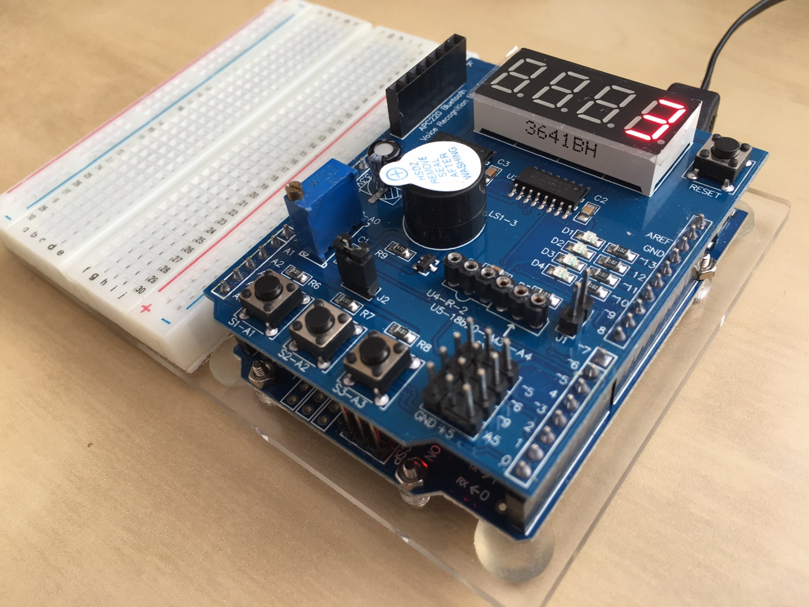
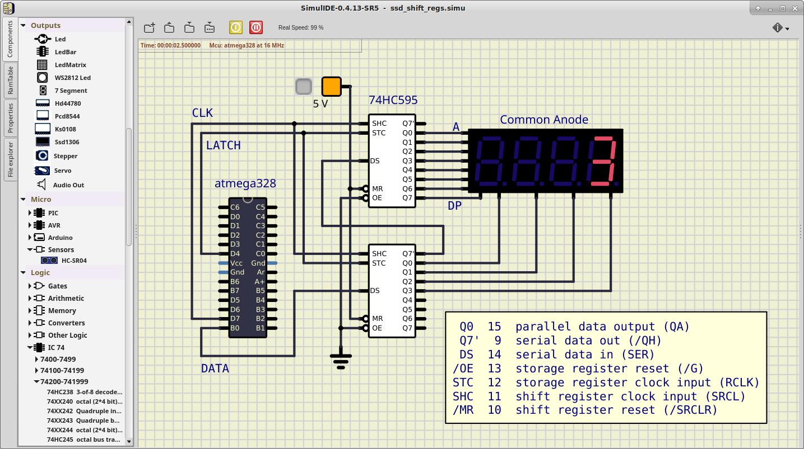
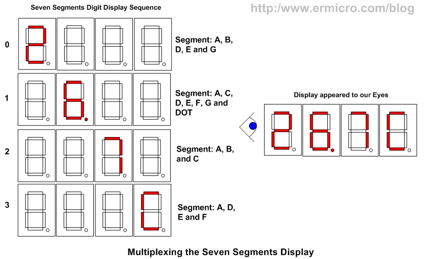

# Lab 5: Display devices, 7-segment display

### Learning objectives

The purpose of the laboratory exercise is to understand the serial control of four seven-segment displays (SSDs) using a pair of 74595 shift registers. In addition, the goal is to master the use of interrupts in applications with AVR.




## Preparation tasks (done before the lab at home)

Read the [7-segment display tutorial](https://www.electronics-tutorials.ws/blog/7-segment-display-tutorial.html) and find out what is the difference between:
   * Common Cathode 7-segment display (CC SSD)
   * Common Anode 7-segment display (CA SSD)

In the following table, write the binary values of the segments for display 0 to 9 on a common anode 7-segment display.

   | **Digit** | **A** | **B** | **C** | **D** | **E** | **F** | **G** | **DP** |
   | :-: | :-: | :-: | :-: | :-: | :-: | :-: | :-: | :-: |
   | 0 | 0 | 0 | 0 | 0 | 0 | 0 | 1 | 1 |
   | 1 |   |   |   |   |   |   |   |   |
   | 2 |   |   |   |   |   |   |   |   |
   | 3 | 0 | 0 | 0 | 0 | 1 | 1 | 0 | 1 |
   | 4 |   |   |   |   |   |   |   |   |
   | 5 |   |   |   |   |   |   |   |   |
   | 6 |   |   |   |   |   |   |   |   |
   | 7 |   |   |   |   |   |   |   |   |
   | 8 |   |   |   |   |   |   |   |   |
   | 9 |   |   |   |   |   |   |   |   |

Use schematic of the [Multi-function shield](../../Docs/arduino_shield.pdf) and find out the connection of seven-segment display. What is the purpose of two shift registers 74HC595?

&nbsp;

&nbsp;

&nbsp;

&nbsp;

&nbsp;

&nbsp;


## Part 1: Synchronize repositories and create a new folder

Run Git Bash (Windows) of Terminal (Linux) and synchronize local and remote repositories. Create a new working folder `Labs/05-segments` for this exercise.


## Part 2: Seven-segment display

**Seven-segment display** (SSD) is an electronic device and consists of eight LEDs connected in parallel that can be lit in different combinations to display the numbers and letters [[1]](https://www.electronics-tutorials.ws/blog/7-segment-display-tutorial.html). These LEDs are called segments and they are titled a, b, ..., g.

Depending upon the decimal digit to be displayed, the particular set of LEDs is forward biased. For instance, to display the numerical digit 0, we will need to light up six of the LED segments corresponding to a, b, c, d, e and f. Thus the various digits from 0 through 9 can be displayed using an SSD. If needed, also usefull letters can be displayed.


The basic ways to control an SSD include:
   * Directly from AVR output pins,
   * Using BCD to 7-segment decoder driver, such as 7447,
   * Via shift register(s).

The shift register method is used in this laboratory. To control the communication, a serial bus (called SPI, Serial Peripheral Interface) is used. Although the ATmega328P includes a hardware SPI drive, in this exercise you shall emulate the serial bus with GPIO operations.

Three signals shall be controlled, called LATCH, CLK, and DATA. These are connected to PD4, PD7 and PB0, respectively as shown in schematic of the [Multi-function shield](../../Docs/arduino_shield.pdf).

Analyze timing of serial communication between ATmega328P and seven-segment displays via two shift registers 74HC595. Example: To display the number `3` at display position 0 (far right position), the following signals must be generated on the three AVR output pins.

&nbsp;

&nbsp;

> The figure above was created in [WaveDrom](https://wavedrom.com/) digital timing diagram online tool. The source of the figure is as follows:
>
```javascript
{signal: [
  {name: 'SEGMENT_LATCH (PD4)',
   wave: '1.l...............h.'},
  {name: 'SEGMENT_CLK (PD7)',
   wave: 'l.nn..............l.'},
  {name: 'SEGMENT_DATA (PB0)',
   wave: 'xx33333333xxxx5555xx',
   data: ['DP','g','f','e','d','c','b','a','p0','p1','p2','p3']},
  {},
  {name: 'Example: digit `3` at position 0',
   wave: 'xx33333333xxxx5555xx',
   data: ['1','0','1','1','0','0','0','0','1','0','0','0']},
],
  head: {
    text: '   1st byte: active-low digit                                    2nd byte: active-high position',
  },
  foot: {
    text: '',
    tock: -2
  },
}
```


### Version: Atmel Studio 7

Create a new GCC C Executable Project for ATmega328P within `05-segment` working folder and copy/paste [template code](main.c) to your `main.c` source file.

In **Solution Explorer** click on the project name, then in menu **Project**, select **Add New Item... Ctrl+Shift+A** and add a new C/C++ Include File `segment.h`. Copy/paste the [template code](../library/include/segment.h) into it.

In **Solution Explorer** click on the project name, then in menu **Project**, select **Add New Item... Ctrl+Shift+A** and add a new C File `segment.c`. Copy/paste the [template code](../library/segment.c) into it.

In **Solution Explorer** click on the project name, then in menu **Project**, select **Add Existing Item... Shift+Alt+A** and add GPIO anf Timer library files (`gpio.h`, `gpio.c`, `timer.h`) from the previous labs.


### Version: Command-line toolchain

Copy `main.c` and `Makefile` files from previous lab to `Labs/05-segment` folder.

Copy/paste [template code](main.c) to your `05-segment/main.c` source file.

Create a new library header file in `Labs/library/include/segment.h` and copy/paste the [template code](../library/include/segment.h) into it.

Create a new `Labs/library/segment.c` library source file and copy/paste the [template code](../library/segment.c) into it.

Add the source file of SSD library between the compiled files in `05-segment/Makefile`.

```Makefile
# Add or comment libraries you are using in the project
#SRCS += $(LIBRARY_DIR)/lcd.c
#SRCS += $(LIBRARY_DIR)/uart.c
#SRCS += $(LIBRARY_DIR)/twi.c
SRCS += $(LIBRARY_DIR)/gpio.c
SRCS += $(LIBRARY_DIR)/segment.c
```


### Both versions

Study the function prototypes and macro defines in the `segment.h` header file.

| **Return** | **Function name** | **Function parameters** | **Description** |
| :-: | :-- | :-- | :-- |
| `void` | `SEG_init` | `void` | Configure SSD signals LATCH, CLK, and DATA as output |
| `void` | `SEG_update_shift_regs` | `uint8_t segments, uint8_t position` | Display segments at one position of the SSD |
| `void` | `SEG_clear` | `void` | Turn off all segments at all positions of the SSD |
| `void` | `SEG_clk_2us` | `void` | Generate one CLK signal period with a duration of 2&nbsp;us |

Define a function for updating the shift registers. Let the function takes two 8-bit variables as inputs: segments to be displayed and position of the display. Bit 0 of first input represents decimal point DP, bit 1 segment G, etc. The suggested structure of the subroutine is presented in [`segment.c`](../library/segment.c) source file. All proposed delay values are equal to 1&nbsp;us, although according to data sheet 74HC595 they may be smaller. Use delay library here for simplicity.

Compile the code and download to Arduino Uno board or load `*.hex` firmware to SimulIDE circuit (create an identical SSD connection using shift registers according to the Multi-function shield).



Verify that the library function works correctly and display values 0 to 9 in different positions on the display.

Create a look-up tables in `segment.c` for getting the segment values given a number between 0 and 9 and positions between 0 and 3.

```C
/* Variables ---------------------------------------------------------*/
// Active-low digits 0 to 9
uint8_t segment_value[] = {
    // abcdefgDP
    0b00000011,     // Digit 0
    0b...,          // Digit 1
    0b...,          // Digit 2
    0b00001101,     // Digit 3
    0b...,
    0b....};

// Active-high position 0 to 3
uint8_t segment_position[] = {
    // p3p2p1p0....
    0b00010000,     // Position 0
    0b00100000,     // Position 1
    0b...,
    0b...};

...
/*--------------------------------------------------------------------*/
void SEG_update_shift_regs(uint8_t segments, uint8_t position)
{
    uint8_t bit_number;
    segments = segment_value[segments];     // 0, 1, ..., 9
    position = segment_position[position];  // 0, 1, 2, 3
    ...
```


## Part 3: Decimal counter

Create a decimal counter from 0 to 9 with output on the 7-segment display. Configure a prescaler of 16-bit Timer/Counter1, enable an interrupt after its overflow, and program the ISR to increment the state of the decimal counter after each overflow. Display the value on the SSD.


### Multiple displays

Create a decimal counter from 00 to 59 with output on the 7-segment display. Use a separate variable for each decade. Let the higher decade be incremented if the lower decade is at its maximum.

To operate multiple displays, it is necessary to constantly switch between them with sufficient speed and repeatedly display the appropriate decade. For switching, add a second timer Timer/Counter0 with an overflow time of 4 ms. When the timer overflows, switch the display position and send its value to the display. Use a static variable within the interrupt handler to keep the information about the current position.

```C
ISR(TIMER0_OVF_vect)
{
    static uint8_t pos = 0;
    ...
}
```




## Synchronize repositories

Use [git commands](https://github.com/tomas-fryza/Digital-electronics-2/wiki/Git-useful-commands) to add, commit, and push all local changes to your remote repository. Check the repository at GitHub web page for changes.


## Experiments on your own

1. Try extending the decimal counter to four positions and display stopwatch values from 00.00 to 59.59.

2. Modify the look-up table and program a cycling snake, such as [[2]](https://www.youtube.com/watch?v=5cIfiIujSPs) or [[3]](https://www.youtube.com/watch?v=pywOh2YC1ik).

3. In segment library, program function `SEG_clear()`, which ensures that the entire display goes out, ie no segment will be switched on, and also the `SEG_clk_2us()` function, which will generate 1 period of a clock signal with a frequency of 800kHz.

Extra. Use basic [Goxygen commands](http://www.doxygen.nl/manual/docblocks.html#specialblock) and revise your `segment.h` comments for later easy generation of PDF documentation.

Extra. According to the [ATmega328P datasheet](https://www.microchip.com/wwwproducts/en/ATmega328p) which I/O registers and which bits configure the Pin Change Interrupts (see External Interrupts)? What vector names have the PCINT [interrupt service routines](https://www.nongnu.org/avr-libc/user-manual/group__avr__interrupts.html)? Complete the table below.

| **Interrupt** | **Vector name** | **Pins** | **Operation** | **I/O register** | **Bit(s)** |
| :-: | :-: | :-: | :-- | :-: | :-: |
| Pin Change Interrupt 0 | `PCINT0_vect` | PB[7:0] | Interrupt enable<br>Select pins | PCICR<br>PCMSK0 | PCIE0<br>PCINT[7:0] |
| Pin Change Interrupt 1 | `PCINT1_vect`|  | Interrupt enable<br>Select pins | <br> | <br> |
| Pin Change Interrupt 2 | `PCINT2_vect`|  | Interrupt enable<br>Select pins | <br> | <br> |

Program an application that uses any push button on Multi-function shield and Pin Change Interrupts 11:9 to reset the decimal counter value. Help: Configure Pin Change Interrupt Control Register (PCICR) and Pin Change Mask Register 1 (PCMSK1).


## Lab assignment

1. Preparation tasks (done before the lab at home). Submit:
    * Table with segments values for display 0 to 9 on a common anode 7-segment display,
    * In your words, describe the difference between Common Cathode and Common Anode 7-segment display.

2. 7-segment library. Submit:
    * Listing of library source file `segment.c`,
    * Listing of decimal counter application `main.c` (at least two-digit decimal counter, ie. from 00 to 59),
    * Screenshot of SimulIDE circuit.

3. Snake. Submit:
    * Look-up table with snake definition,
    * Listing of your snake cycling application `main.c` (at least one-digit snake).

The deadline for submitting the task is the day before the next laboratory exercise. Use [BUT e-learning](https://moodle.vutbr.cz/) web page and submit a single PDF file.
