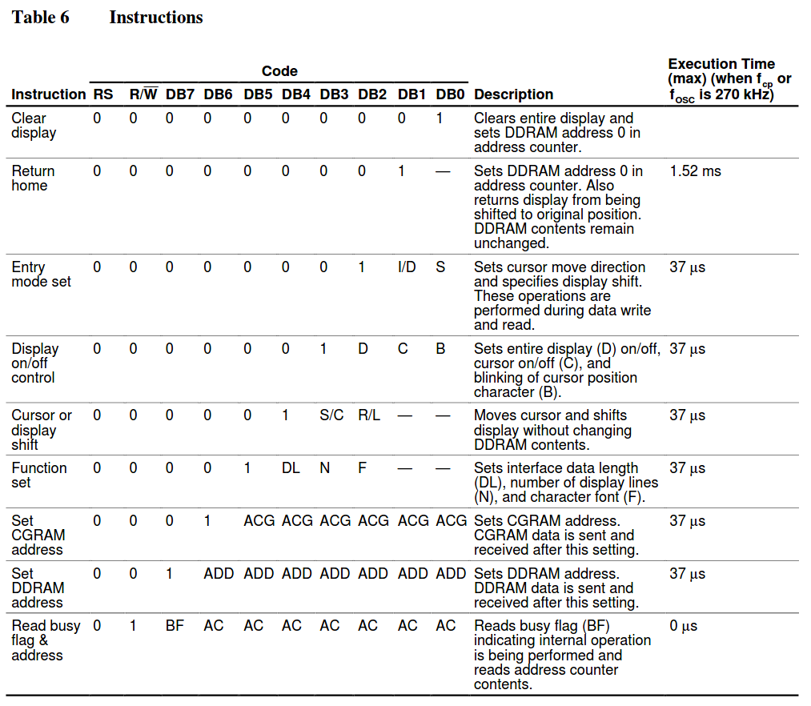
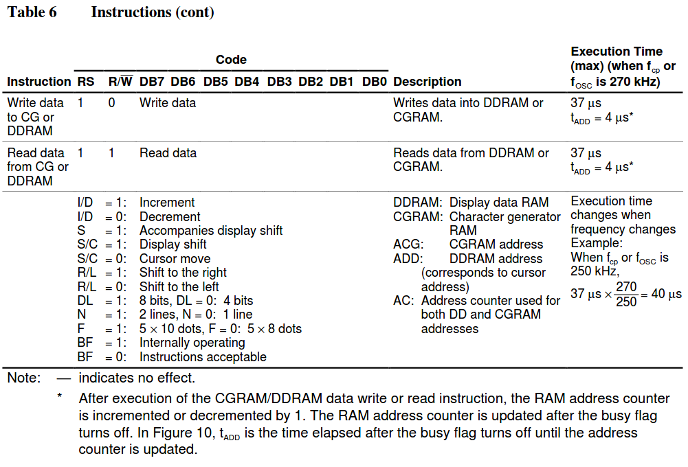
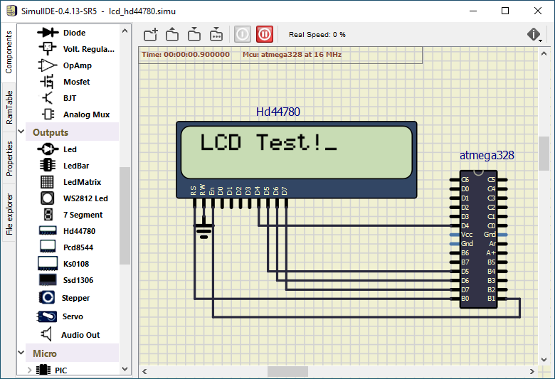
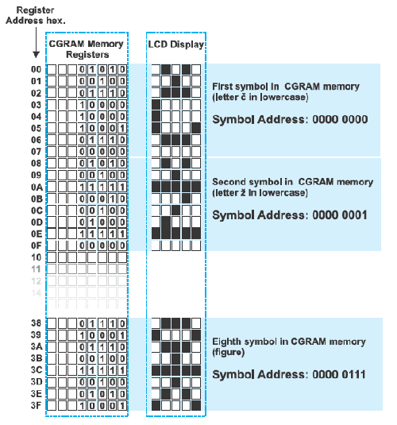

# Lab 6: Display devices, LCD display

### Learning objectives

The purpose of the laboratory exercise is to understand the serial control of Hitachi HD44780-based LCD character display. Another goal is to learn how to read documentation for library functions and use them in your own project.


## Preparation tasks (done before the lab at home)

Use schematic of the [LCD keypad shield](../../Docs/arduino_shield.pdf) and find out the connection of LCD display. What data and control signals are used? What is the meaning of these signals?

&nbsp;

&nbsp;

&nbsp;

&nbsp;

&nbsp;

&nbsp;

   | **LCD signal(s)** | **AVR pin(s)** | **Description** |
   | :-: | :-: | :-- |
   | RS | PB0 | Register selection signal. Selection between Instruction register (RS=0) and Data register (RS=1) |
   | R/W |  |  |
   | E |  |  |
   | D[3:0] |  |  |
   | D[7:4] |  |  |

What is the ASCII table? What are the values for uppercase letters `A` to `Z`, lowercase letters `a` to `z`, and numbers `0` to `9` in this table?

&nbsp;

&nbsp;

&nbsp;


## Part 1: Synchronize repositories and create a new folder

Run Git Bash (Windows) of Terminal (Linux), navigate to your working directory, and update local repository. Create a new working folder `Labs/06-lcd` for this exercise.


## Part 2: LCD display module

**LCD** (Liquid Crystal Display) is an electronic display device which is used for display any ASCII text. There are many different screen sizes e.g. 16x1, 16x2, 16x4, 20x4, 40x4 characters and each character is made of 5x8 pixel dots. LCD displays have different LED backlight in yellow-green, white and blue color. LCD modules are mostly available in COB (Chip-On-Board) type. With this method, the controller IC chip or driver (here: HD44780) is directly mounted on the backside of the LCD module itself.

The control is based on the Hitachi HD44780 (or a compatible) chipset, which is found on most text-based LCDs, and hence the driving software remains the same even for different screen sizes. The driver contains instruction set, character set but in addition you can also generate your own characters.

The HD44780 is capable of operating in 8-bit mode i.e. faster, but that means 11 microcontroller pins are needed. Because the speed is not really that important as the amount of data needed to drive the display is low, the 4-bit mode is more appropriate for microcontrollers since only 6 (or 7) pins are needed.

In 8-bit mode we send the command/data to the LCD using eight data lines (D0-D7), while in 4-bit mode we use four data lines (D4-D7) to send commands and data. Inside the HD44780 there is still an 8-bit operation so for 4-bit mode, two writes to get 8-bit quantity inside the chip are made (first high four bits and then low four bits with an E clock pulse).

In the lab, the LCD1602 display module is used. The display consists of two rows of 16 characters each. Ih has an LED backlight and it interfaces through a parallel interface with only 6 wires for the HD44780:
   * RS - register select. Selects the data or instruction register inside the HD44780,
   * E - enable. This loads the data into the HD44780 on the falling edge,
   * D7:4 - Upper nibble used in 4-bit mode.


When a command is given on the LCD, we select the command register (RS = 0) and when data is sent to the LCD for display, we select the data register (RS = 1). A command is an instruction entered on the LCD in order to perform the required function according to the given command. In order to display textual information, data is send to LCD.

Let the following image shows the communication between ATmega328P and LCD display in 4-bit mode. How does HD44780 driving chipset understand the sequence of these signals?

&nbsp;


The following signals are read on the first falling edge of the enable: `RS = 1` (data register) and high four bits are `D7:4 = 0100`. On the second falling edge of enable, the low four data bits are `D7:4 = 0011`. The whole byte transmitted to the LCD is therefore `0100_0011` (0x43) and according to the ASCII (American Standard Code for Information Interchange) table, it represents lettre `C`.

The Hitachi HD44780 has many commands, the most useful for initialization, xy location settings, and print [[1]](https://www.sparkfun.com/datasheets/LCD/HD44780.pdf).





If you are an advanced programmer and would like to create your own library for interfacing your microcontroller with an LCD module then you have to understand those instructions and commands which can be found its datasheet.


## Part 3: Library for HD44780 based LCDs

In the lab, we are using [LCD library for HD44780 based LCDs](http://www.peterfleury.epizy.com/avr-software.html) developed by Peter Fleury. Use online manual of LCD library and add the input parameters and description of the functions to the following table.

   | **Function** | **Parameter(s)** | **Description** |
   | :-: | :-: | :-- |
   | `lcd_init` | `LCD_DISP_OFF`<br>&nbsp;<br>&nbsp;<br>&nbsp; | Display off&nbsp;&nbsp;&nbsp;&nbsp;&nbsp;&nbsp;&nbsp;&nbsp;&nbsp;&nbsp;&nbsp;&nbsp;&nbsp;&nbsp;&nbsp;&nbsp;&nbsp;&nbsp;&nbsp;&nbsp;&nbsp;&nbsp;&nbsp;&nbsp;&nbsp;&nbsp;&nbsp;&nbsp;&nbsp;&nbsp;&nbsp;&nbsp;&nbsp;&nbsp;&nbsp;&nbsp;&nbsp;&nbsp;&nbsp;&nbsp;&nbsp;&nbsp;&nbsp;&nbsp;&nbsp;&nbsp;&nbsp;&nbsp;&nbsp;&nbsp;&nbsp;&nbsp;&nbsp;&nbsp;&nbsp;&nbsp;&nbsp;&nbsp;&nbsp;&nbsp;&nbsp;&nbsp;&nbsp;&nbsp;&nbsp;&nbsp;&nbsp;&nbsp;&nbsp;<br>&nbsp;<br>&nbsp;<br>&nbsp;
   | `lcd_clrscr` | | |
   | `lcd_home` | | |
   | `lcd_gotoxy` | | |
   | `lcd_putc` | | |
   | `lcd_puts` | | |
   | `lcd_command` | | |
   | `lcd_data` | | |


### Version: Atmel Studio 7

Create a new GCC C Executable Project for ATmega328P within `06-lcd` working folder and copy/paste [template code](main.c) to your `main.c` source file.

In **Solution Explorer** click on the project name, then in menu **Project**, select **Add Existing Item... Shift+Alt+A** and add LCD library files `lcd.h`, `lcd_definitions.h`, `lcd.c` from `Labs/library` folder and timer library `timer.h` from the previous labs.


### Version: Command-line toolchain

Copy `main.c` and `Makefile` files from previous lab to `Labs/06-lcd` folder.

Copy/paste [template code](main.c) to your `06-lcd/main.c` source file.

Add the source file of LCD library between the compiled files in `06-lcd/Makefile`.

```Makefile
# Add or comment libraries you are using in the project
SRCS += $(LIBRARY_DIR)/lcd.c
#SRCS += $(LIBRARY_DIR)/uart.c
#SRCS += $(LIBRARY_DIR)/twi.c
#SRCS += $(LIBRARY_DIR)/gpio.c
#SRCS += $(LIBRARY_DIR)/segment.c
```


### Both versions

Test functions from the table above. Compile the code and download to Arduino Uno board or load `*.hex` firmware to SimulIDE circuit (create an identical LCD connection to the LCD keypad shield).



Verify that the library function works correctly and display values 0 to 9 in different positions on the display.


## Part 4: Stopwatch

1. According to the listing bellow, verify how you can convert a variable value to string and then display it on LCD. Display one variable value in decimal, binary, and hexadecimal. What are the parameters of standard C function `itoa`?

    ```C
    #include <stdlib.h>

    uint8_t value = 31;
    char lcd_string[3];
    ...

    itoa(value, lcd_string, 16);
    lcd_putc('$');
    lcd_puts(lcd_string);
    ```

2. Configure Timer1 clock source, enable its overflow interrupt, create a decimal counter from 0 to 255, and show the value on LCD display.


## User-defined symbols


The LCD character map is a table of information (memory locations) located on the controller. The map assigns a number between 0 and 255 to each letter, number and punctuation mark. When you want your customer to see a capital A, you send it number 64 and if you want it to display an 8 you send it a 122.


*User-defined symbols are represented by eight bytes (lines) and they are stored in the beginning of [CGRAM display memory](https://www.mikroe.com/ebooks/pic-microcontrollers-programming-in-c/additional-components).*



1. Design at least two user characters, store them in the display memory according to the following code and display them on LCD.

    ```C
    /* Variables ---------------------------------------------------------*/
    // User-defined LCD chars
    uint8_t lcd_charset[] = {0x0a, ...};
    ...

    // Set pointer to beginning of CGRAM memory
    lcd_command(_BV(LCD_CGRAM));
    // Store new chars to memory line by line
    lcd_data(lcd_charset[0]);
    ...

    // Clear display for the first use
    lcd_clrscr();
    ...

    // Display first user-defined character
    lcd_putc(0x00);
    ```


## Clean project and synchronize git

Remove all binaries and object files from the working directory. Then use git commands, commit all modified/created files to your local repository and push them to remote repository or use VS Code options to perform these operations.


## Ideas for other tasks

1. Use new characters and create a bar graph at LCD. Let the bar state corresponds to decimal counter value, similar to the following figure.


https://protostack.com.au/2010/03/character-lcd-displays-part-1/
https://www.st.com/en/embedded-software/stsw-stm8063.html#documentation

Using these it is possible to create a simple bar graph to display a graphical representation of voltage etc.
