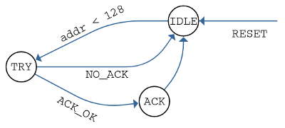

# Lab 8: I2C/TWI serial communication

### Learning objectives

The purpose of the laboratory exercise is to understand XXX


## Preparation tasks (done before the lab at home)

Use schematic of the [Arduino Uno](../../Docs/arduino_shield.pdf) board and find out to which pins the SDA and SCL signals are connected.

   | **Signal** | **MCU pin** | **Arduino pin(s)** |
   | :-: | :-: | :-: |
   | SDA (data)  |  |  |
   | SCL (clock) |  |  |

What is the general structure of I2C address and data frames?

   | **Frame type** | **8** | **7** | **6** | **5** | **4** | **3** | **2** | **1** | **0** | **Description**&nbsp;&nbsp;&nbsp;&nbsp;&nbsp;&nbsp;&nbsp;&nbsp;&nbsp;&nbsp;&nbsp;&nbsp;&nbsp;&nbsp;&nbsp;&nbsp;&nbsp;&nbsp;&nbsp;&nbsp;&nbsp;&nbsp;&nbsp;&nbsp;&nbsp;&nbsp;&nbsp;&nbsp;&nbsp;&nbsp;&nbsp;&nbsp;&nbsp;&nbsp;&nbsp;&nbsp;&nbsp;&nbsp;&nbsp;&nbsp;&nbsp;&nbsp;&nbsp;&nbsp; |
   | :-: | :-: | :-: | :-: | :-: | :-: | :-: | :-: | :-: | :-: | :-- |
   | Address | | | | | | | | | | |
   | Data    | | | | | | | | | | |


## Part 1: Synchronize repositories and create a new folder

Run Git Bash (Windows) of Terminal (Linux), navigate to your working directory, and update local repository. Create a new working folder `Labs/08-i2c` for this exercise.


## Part 2: I2C bus

**TODO**

2. What frames are used in I2C communication according to the following waveforms?

   &nbsp;
   

   | **Frame #** | **Description** |
   | :-: | :-- |
   | 1 | &nbsp;&nbsp;&nbsp;&nbsp;&nbsp;&nbsp;&nbsp;&nbsp;&nbsp;&nbsp;&nbsp;&nbsp;&nbsp;&nbsp;&nbsp;&nbsp;&nbsp;&nbsp;&nbsp;&nbsp;&nbsp;&nbsp;&nbsp;&nbsp;&nbsp;&nbsp;&nbsp;&nbsp;&nbsp;&nbsp;&nbsp;&nbsp;&nbsp;&nbsp;&nbsp;&nbsp;&nbsp;&nbsp;&nbsp;&nbsp;&nbsp;&nbsp;&nbsp;&nbsp;&nbsp;&nbsp;&nbsp;&nbsp;&nbsp;&nbsp;&nbsp;&nbsp;&nbsp;&nbsp;&nbsp;&nbsp;&nbsp;&nbsp;&nbsp;&nbsp;&nbsp;&nbsp;&nbsp;&nbsp;&nbsp;&nbsp;&nbsp;&nbsp;&nbsp;&nbsp;&nbsp;&nbsp;&nbsp;&nbsp;&nbsp;&nbsp;&nbsp;&nbsp;&nbsp;&nbsp; |
   | 2 |  |
   | 3 |  |
   | 4 |  |
   | 5 |  |


## Part 3: I2C scanner

1. Use breadboard to connect humidity/temperature DHT12 digital sensor and real time clock (RTC) device DS3231 to Arduino Uno board. Use 3.3 V voltage for both TWI modules.


2. Use header file `library/Include/twi.h` of the TWI library and add the functions' input parameters, output values, and description to the following table.

   | **Function** | **Parameter(s)** | **Description** |
   | :-: | :-: | :-- |
   | `twi_init` | None | Initialize TWI, enable internal pull-up resistors, and set SCL frequency |
   | `twi_start` |  |  |
   | `twi_write` | <br>&nbsp; |  |
   | `twi_read_ack` | <br>&nbsp; |  |
   | `twi_read_nack` | <br>&nbsp; |  |
   | `twi_stop` |  |  |

3. Use template from [teacher's GitHub](https://github.com/tomas-fryza/Digital-electronics-2/blob/master/Labs/08-twi_scan/main.c), explore the use of FSM (Finite State Machine) in the application, set Timer1 overflow to 33 msec, scan all slave addresses and transmit results via UART to PuTTY SSH Client. How many slave devices there are connected?

    &nbsp;
    

    | **Address** | **TWI device** |
    | :-: | :-: |
    |  | &nbsp;&nbsp;&nbsp;&nbsp;&nbsp;&nbsp;&nbsp;&nbsp;&nbsp;&nbsp;&nbsp;&nbsp;&nbsp;&nbsp;&nbsp;&nbsp;&nbsp;&nbsp;&nbsp;&nbsp;&nbsp;&nbsp;&nbsp;&nbsp;&nbsp;&nbsp;&nbsp;&nbsp;&nbsp;&nbsp;&nbsp;&nbsp;&nbsp;&nbsp;&nbsp;&nbsp;&nbsp;&nbsp;&nbsp;&nbsp;&nbsp;&nbsp;&nbsp;&nbsp;&nbsp;&nbsp;&nbsp; |
    |  | &nbsp; |
    |  | &nbsp; |

4. Form the UART output of your application to a hexadecimal table view according to the following example. See [I2C-bus specification and user manual](https://www.nxp.com/docs/en/user-guide/UM10204.pdf) for reserved addresses (RA).

    ```
    Scan I2C-bus for devices:
    
        .0 .1 .2 .3 .4 .5 .6 .7 .8 .9 .a .b .c .d .e .f
    0.: RA RA RA RA RA RA RA RA -- -- -- -- -- -- -- -- 
    1.: -- -- -- -- -- -- -- -- -- -- -- -- -- -- -- -- 
    2.: -- -- -- -- -- -- -- -- -- -- -- -- -- -- -- -- 
    3.: -- -- -- -- -- -- -- -- -- -- -- -- -- -- -- -- 
    4.: -- -- -- -- -- -- -- -- -- -- -- -- -- -- -- -- 
    5.: -- -- -- -- -- -- -- 57 -- -- -- -- -- -- -- --
    6.: -- -- -- -- -- -- -- -- -- -- -- -- -- -- -- -- 
    7.: -- -- -- -- -- -- -- -- RA RA RA RA RA RA RA RA
    ```


## DHT12 temperature and humidity sensor

1. Create a new project folder `08-twi_temperature` and copy three files from `08-twi_scan` project.

2. Program an FSM application which reads data from humidity/temperature DHT12 digital sensor and sends them periodically via UART to PuTTY SSH Client. Note, according to the [DHT12 manual](../../Docs/dht12_manual.pdf), the internal DHT12 data registers have the following structure.

   | **Register address** | **Description** |
   | :-: | :-- |
   | 0x00 | Humidity integer part |
   | 0x01 | Humidity fractional part |
   | 0x02 | Temperature integer part |
   | 0x03 | Temperature fractional part |
   | 0x04 | Checksum |

3. Find out how checksum byte value is calculated.


## Synchronize repositories

Use [git commands](https://github.com/tomas-fryza/Digital-electronics-2/wiki/Git-useful-commands) to add, commit, and push all local changes to your remote repository. Check the repository at GitHub web page for changes.


## Experiments on your own

1. Xxx.

2. Xxx.


### Version: Real hardware

3. Extend the FSM application, read second/minute values from RTC DS3231 device, and send them via UART to PuTTY SSH Client. According to the [DS3231 manual](../../Docs/ds3231_manual.pdf), the internal RTC registers have the following structure.

   | **Address** | **Bit 7** | **Bits 6:4** | **Bits 3:0** |
   | :-: | :-: | :-: | :-: |
   | 0x00 | 0 | 10 Seconds | Seconds |
   | 0x01 | 0 | 10 Minutes | Minutes |
   | ... | ... | ... | ... |

4. Verify the TWI communication with logic analyzer. Find out the structure of other internal RTC registers and implement the hour-value reading process.


## Lab assignment

1. Preparation tasks (done before the lab at home). Submit:
   * Table with xxx.

2. I2C. Submit:
   * (Hand-drawn) picture of I2C signals when xxxx,
   * Listing of xxx.
   * Screenshot of SimulIDE circuit when "Power Circuit" is applied.

The deadline for submitting the task is the day before the next laboratory exercise. Use [BUT e-learning](https://moodle.vutbr.cz/) web page and submit a single PDF file.


## References

1. Xxx
