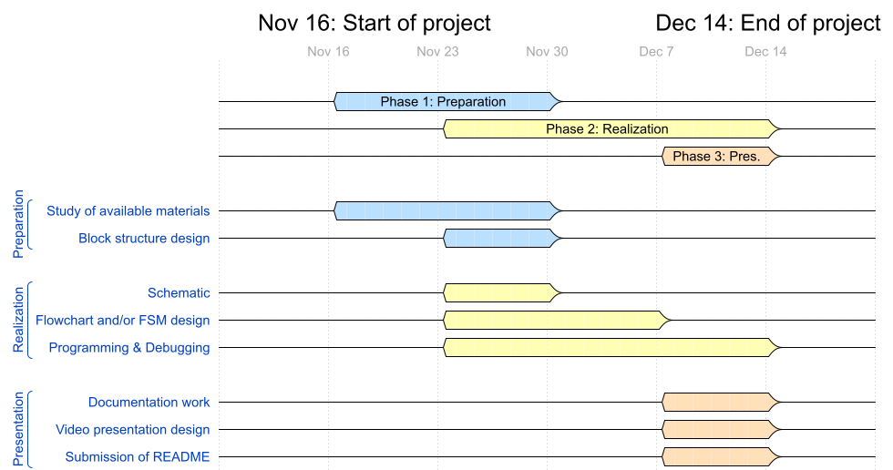

# C project: General instructions

The aim of the C project is cooperation in small teams, study of assigned topic, design of own solution, simulation, implementation, creation of project documentation and presentation of results. Students are divided into groups that represent small teams within a company. Their task will be to redistribute the work, fulfill the assigned task and defeat competing teams from the "company". The division of roles and tasks within the team is up to their members. All team members will be evaluated with the same number of points. *Any non-cooperation of some of the team members will be resolved individually*.

* Students work on the project in laboratories from the 9th to 13th week of the semester in groups of 3 to 4 students.

* Students may consult the project within their own team, with their laboratory teacher and may not assign anyone else, including other students, academics, or PhD students. Consultations with the teacher will take place during the laboratories.

* Students present their results during the last laboratory in the 13th week of the semester.

* The source code for the AVR must be written in C and must be implementable on Arduino Uno board using toolchains used in the lab during the semester. Any other development tool is not allowed.

* Smaller functions can be written in AVR assembly as well.

## Will be evaluated

* Submitted README file (see below)
* Content of GitHub repository
* Complexity of created application, functionality
* Other functionality beyond the topic
* If the topic has been completed
* C guideline, mainly: division of code into functions/libraries, code purity and correctness, indentation, usage of comments
* Usage of codes and libraries from previous exercises instead of copying from Internet
* Presence of C project with generated HEX file
* Completeness and clarity of documentation
* Discussion of results
* 5-minute video presentation in English, Czech, or Slovak

> ## Bude hodnoceno
>
> * Obsah odeslaného souboru README (viz dále)
> * Obsah GiThub repozitáře
> * Složitost vytvořené aplikace, funkčnost
> * Přidání vlastní funkcionality nad rámec zadání
> * Zda práce odpovídá zadání
> * C guidelines, především: rozdělení kódu na funkce/knihovny, čistota a správnost kódu, odsazení, použití komentářů
> * Využití kódů a knihoven z předchozích cvičení namísto kopírování z internetu
> * Přítomnost kompletního projektu v C a vygenerovaný HEX soubor
> * Úplnost a jasnost dokumentace
> * Diskuse o výsledcích
> * 5minutová video prezentace v angličtině, češtině, nebo slovenštině
>

## The repository folder itself must contain

* Project README file according to the required structure (You will export and submit this file). The README file can be written in English, Czech, or Slovak
* Complete project in Microchip/Atmel Studio 7 or Command-line tool with AVR 8-bit Toolchain v3.62 for Windows or 3.6.2 for Linux. All source files must be written in English
* Libraries of all components that you have developed, including its documentation
* External circuit diagrams and their simulations, if needed
* Literature references you used

## README template

The README file contains a complete description of the problem, circuit diagram, graphical representation of the application (flowchart or state diagram), links to source files in the repository (do NOT include whole code listing to README), discussion of results, list of references, link to your video presentation, etc. Use this required structure of [project README file](Project.md).

The deadline for submitting the project is **Tuesday Dec 14, 2021**. Use BUT e-learning web page, export your project README file to PDF and submit it.

## Topics 2021/22

Coming soon...

## Topics 2020/21

1. [Description of 4x3 keyboard control](https://github.com/dkorbey/Door-Lock-Project). Application of the door lock system; display; door unlock relay; own library for keypad scanning; time limit for entering the correct 4-digit code; several correct codes to distinguish more people; signaling of entering the wrong code; time delay for re-locking the lock approx. 2 to 3 seconds; sending interesting information about the status of the application to the UART.

   > *Popis ovládání klávesnice 4x3. Aplikace systému pro otevírání zámku dveří; displej; relé pro odemknutí dveří; vlastní knihovna pro skenování klávesnice; časový limit pro zadání správného 4místného kódu; několik správných kódů pro rozlišení více lidí; signalizace zadání špatného kódu; časová prodleva pro opětovné uzamčení zámku cca 2 až 3 sekundy; odesílání zajímavých informací o stavu aplikace na UART.*
   >

2. Description of ultrasonic sensor HC-SR04 control. Parking assistant application using several ultrasonic sensors (Micro > Sensors > HC-SR04, see an example in SimulIDE: File explorer > Examples > Arduino > Arduino_SR04 > arduino_sr04.simu); display; distance in centimeters; acoustic signaling with different frequencies according to distance; distance indication on LED bar; sending interesting information about the status of the application to the UART.

   > *Popis ovládání ultrazvukového senzoru HC-SR04. Aplikace parkovacího asistenta pomocí několika ultrazvukových senzorů (Micro> Sensors> HC-SR04, viz příklad přímo v prostředí SimulIDE: File explorer > Examples > Arduino > Arduino_SR04 > arduino_sr04.simu); displej; vzdálenost v centimetrech; akustická signalizace s různými frekvencemi podle vzdálenosti; indikace vzdálenosti na LED panelu; odesílání zajímavých informací o stavu aplikace na UART.*
   >

3. [Function description R-2R ladder Digital to Analog Converter (DAC)](https://github.com/vymaztom/Digital-electronics-2/tree/master/Labs/Projekt). Application of analog signal generator using at least 8-bit DAC; several preset signal types; display; 4x3 keypad control; (possibility of DTMF, Dual-Tone Multiple Frequencies tone generation); sending interesting information about the status of the application to the UART.

   > *Popis funkce R-2R ladder digitálně analogového převodníku (Digital to Analog Converter, DAC). Aplikace generátoru analogového signálu využívající alespoň 8bitový DAC; několik přednastavených typů signálů; displej; ovládání pomocí klávesnice 4x3; (volitelně možnost generování tónu DTMF, Dual-Tone Multiple Frequencies); odesílání zajímavých informací o stavu aplikace na UART.*
   >
