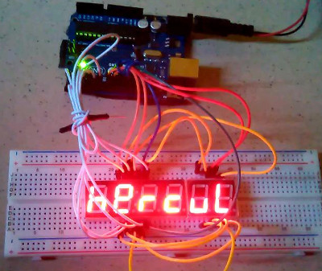

# Lab 5. Display devices, 7-segment display

#### Table of contents

1. [Lab prerequisites](#Lab-prerequisites)
2. [Hardware components](#Hardware-components)
3. [Synchronize Git and create a new project](#Synchronize-Git-and-create-a-new-project)
4. [Pin Change Interrupts](#Pin-Change-Interrupts)
5. [Seven-segment display](#Seven-segment-display)
6. [Decimal counter](#Decimal-counter)
7. [Clean project and synchronize git](#Clean-project-and-synchronize-git)
8. [Ideas for other tasks](#Ideas-for-other-tasks)


## Lab prerequisites

1. According to the [ATmega328P datasheet](https://www.microchip.com/wwwproducts/en/ATmega328p) which I/O registers and which bits configure the Pin Change Interrupts (see External Interrupts)? What vector names have the PCINT [interrupt service routines](https://www.nongnu.org/avr-libc/user-manual/group__avr__interrupts.html)?

    | **Interrupt** | **Vector name** | **Pins** | **Operation** | **I/O register** | **Bit(s)** |
    | :-: | :-: | :-: | :-- | :-: | :-: |
    | Pin Change Interrupt 0 | `PCINT0_vect` | PB[7:0] | Interrupt enable<br>Select pins | PCICR<br>PCMSK0 | PCIE0<br>PCINT[7:0] |
    | Pin Change Interrupt 1 | `PCINT1_vect`|  | Interrupt enable<br>Select pins | <br> | <br> |
    | Pin Change Interrupt 2 | `PCINT2_vect`|  | Interrupt enable<br>Select pins | <br> | <br> |

2. Use schematic of the [Multi-function shield](../../docs/arduino_shield.pdf) and find out the connection of seven-segment display. What is the purpose of two shift registers 74HC595?


## Hardware components

1. [ATmega328P](https://www.microchip.com/wwwproducts/en/ATmega328P) 8-bit AVR microcontroller
2. [Arduino Uno](../../docs/arduino_shield.pdf) board
3. [Multi-function shield](../../docs/arduino_shield.pdf) with four LEDs, three push buttons, four seven-segment displays
4. 24MHz 8-channel [logic analyzer](https://www.saleae.com/)

    &nbsp;
    


## Synchronize Git and create a new project

1. In VS Code open your Digital-electronics-2 working directory and synchronize the contents with single git command `git pull` or sequence of two commands `git fetch` followed by `git merge`.

2. Create a new folder `firmware/05-segment` and copy files from the last project.


## Pin Change Interrupts

1. Program an application that uses three push buttons on Multi-function shield and Pin Change Interrupts 11:9 to toggle a single LED. Help: Configure Pin Change Interrupt Control Register (PCICR)) and Pin Change Mask Register 1 (PCMSK1).


## Seven-segment display

*[Seven-segment](https://www.electronics-tutorials.ws/blog/7-segment-display-tutorial.html) is an electronic display device and consists of eight LEDs connected in parallel that can be lit in different combinations to display the numbers and letters.*

1. Use schematic of the [Multi-function shield](../../docs/arduino_shield.pdf) and analyze timing of serial communication between ATmega328P and seven-segment displays via two shift registers 74HC595.

    &nbsp;
    
    &nbsp;

> The figure above was created in [WaveDrom](https://wavedrom.com/) digital timing diagram online tool. The source of the figure is as follows:
>
```javascript
{signal: [
  {name: 'Example: digit "3" at position "0"',
   wave: 'xx33333333xxxx5555xx',
   data: ['1','0','1','1','0','0','0','0','1','0','0','0']},
  {name: 'SEGMENT_DATA (PB0)',
   wave: 'xx33333333xxxx5555xx',
   data: ['DP','g','f','e','d','c','b','a','pos0','pos1','pos2','pos3']},
  {name: 'SEGMENT_CLK (PD7)',
   wave: 'l.nn..............l.'},
  {name: 'SEGMENT_LATCH (PD4)',
   wave: '0.................pl'},
],
  head:{
  text: '     1st byte: active-low digit                                       2nd byte: active-high position',
  },
  foot:{
  	text: '',
  	tock: -2
  },
}
```

2. Create a new library header file `library/include/segment.h` and define function prototypes for communication with shift registers according to [DE2 repository](https://github.com/tomas-fryza/Digital-electronics-2/tree/master/firmware/library/include).

3. Create `library/source/segment.c` source file according to [DE2 repository](https://github.com/tomas-fryza/Digital-electronics-2/tree/master/firmware/library/source):
    * complete look-up table `segment_digit[]` specifies active-low digits 0 to 9,
    * program body of `SEG_putc(uint8_t digit, uint8_t position)` function where `digit` represents value to display at specific `position`, and
    * program body of `SEG_toggle_clk(void)` function which generates 2&nbsp;us clock pulse at `SEGMENT_CLK` pin.

4. Add the source file of seven-segment library between the compiled files in `05-segment/Makefile` and verify functions' reliability and correct settings for all digits.


## Decimal counter
1. Use push buttons and Pin Change Interrupt 11:9 to increment value at seven-segment display from 0 to 9.

2. Extend the counter and display values from 0 to 99. Use 8-bit internal Timer0 to multiplex the display position.
    
3. At what frequency it is necessary to switch between the display positions in order to avoid blinking?


## Clean project and synchronize git

Remove all binaries and object files from the working directory. Then use git commands, commit all modified/created files to your local repository and push them to remote repository or use VS Code options to perform these operations.


## Ideas for other tasks

1. Extend the look-up-table and define letters according to ASCII table. Program a scrolling text application at seven-segment display.

    

2. Use basic [Goxygen commands](http://www.doxygen.nl/manual/docblocks.html#specialblock) inside C-code comments and prepare your `segment.h` library header file for easy PDF manual generation.
