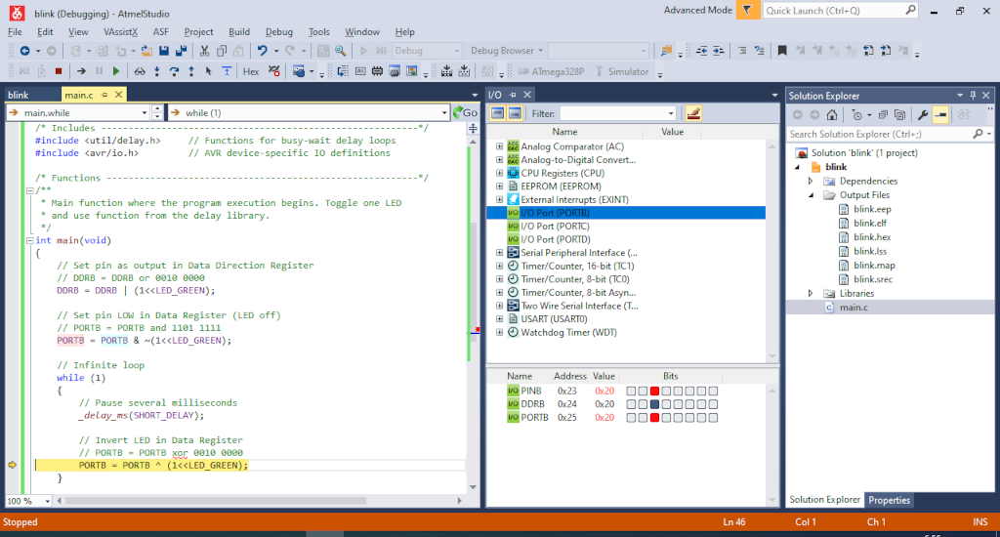

# Lab 1: Git version-control system, AVR tools

<!--

-->

### Learning objectives

After completing this lab you will be able to:

* Use markdown README files
* Create git repository
* Understand basic structure of C files
* Compile and download firmware to AVR device
* Use breadboard and connect electronic devices to AVR pins

The purpose of this laboratory exercise is to learn how to use the git versioning system, write the markdown readme file, learn the basic structure of C code, and learn how to use development tools to program ATmega328P microcontroller on the Arduino Uno board.

### Table of contents

* [Pre-Lab preparation](#preparation)
* [Part 1: GitHub](#part1)
* [Part 2: Local repository](#part2)
* [Part 3: Install and test AVR tools](#part3)
* [Part 4: (Optional) SimulIDE](#part4)
* [Part 5: (Optional) Logic analyzer](#part5)
* [Experiments on your own](#experiments)
* [Post-Lab report](#report)
* [References](#references)

<a name="preparation"></a>

## Pre-Lab preparation

1. If you don't have any, create a free account on [GitHub](https://github.com/signup?source=login).

3. For future synchronization of local folders with GitHub, download and install [git](https://git-scm.com/). Git is free, open source, and available on Windows, Mac, and Linux platforms. Window users will also need to use the Git Bash application (installed automatically with git) for command line operations.

3. (Optional) Download and install [SimulIDE](https://www.simulide.com/p/home.html) electronic circuit simulator.

4. (Optional) If you have option to use Arduino Uno board and logic analyzer, also download and install [Saleae Logic 1](https://support.saleae.com/logic-software/legacy-software/older-software-releases#logic-1-x-download-links).

<a name="part1"></a>

## Part 1: GitHub

GitHub is a code hosting platform for collaboration and version control. GitHub lets you (and others) work together on projects.

1. In GitHub, create a new public repository titled **digital-electronics-2**. Initialize a README, C template .gitignore, and [MIT license](https://choosealicense.com/licenses/mit/).

2. Use one of the available git manuals, such as [1](https://medium.com/swlh/how-to-make-the-perfect-readme-md-on-github-92ed5771c061), [2](https://help.github.com/en/articles/basic-writing-and-formatting-syntax), or [3](https://guides.github.com/features/mastering-markdown/), and add the following sections to your README file.

   * Headers H1, H2, H3
   * Emphasis (*italics*, **bold**)
   * Lists (ordered, unordered)
   * Links
   * Table
   * Listing of C source code (with syntax highlighting)

<a name="part2"></a>

## Part 2: Local repository

1. Use your favorite file manager and run Git Bash (Windows) or Terminal (Linux) inside your home folder `Documents`.

2. With help of `git` command, clone a local copy of your public repository.

   > Useful git command is: `git clone` - Create a local copy of remote repository. This command is executed just once; later synchronization between remote and local repositories is performed differently.
   >
   > Useful bash commands are: `cd` - Change working directory. `mkdir` - Create directory. `ls` - List information about files in the current directory. `ls -a` - List information aout all files in the current directory. `pwd` - Print the name of the current working directory.
   >

   ```bash
   ## Windows Git Bash or Linux:
   $ git clone https://github.com/your-github-account/digital-electronics-2
   $ cd digital-electronics-2/
   $ ls -a
   .gitignore  LICENSE  README.md
   ```

3. Set username and email for your repository (values will be associated with your later commits):

   ```shell
   $ git config user.name "your-git-user-name"
   $ git config user.email "your-email@address.com"
   ```
   
   You can varify that the changes were made correctly by:
   
   ```shell
   $ git config --list
   ```

<a name="part3"></a>

## Part 3: Install and test AVR tools

1. Run Visual Studio Code, follow these [instructions](https://github.com/tomas-fryza/digital-electronics-2/wiki/How-to-use-AVR-template-with-PlatformIO) and install the PlatformIO plugin.

2. Create a new project `lab1-blink_arduino`, select `Arduino Uno` board, and change project location to your local repository folder `Documents/digital-electronics-2`. Copy/paste [blink example code](https://raw.githubusercontent.com/tomas-fryza/digital-electronics-2/master/examples/blink_arduino/main.cpp) from this repository to your `LAB1-BLINK_ARDUINO > src > main.cpp` file.

   Rename source file `main.cpp` to `main.c`, ie change the extension to `.c`.

3. Compile and download the firmware to target ATmega328P microcontroller. Go through all the lines of code and make sure you understand their function. Change the delay duration and observe the behavior of on-board LED.

   * See Arduino Uno [pinout](https://docs.arduino.cc/static/6ec5e4c2a6c0e9e46389d4f6dc924073/2f891/Pinout-UNOrev3_latest.png)
   * See Arduino Docs for [GPIO / Pin Management](https://docs.arduino.cc/learn/starting-guide/getting-started-arduino#gpio--pin-management)

4. Use breadboard, wires, resistor, and a second LED. Connect in to a GPIO output in active-low way and modify your code to blink both LEDs.

   

5. Copy/paste [report template](https://raw.githubusercontent.com/tomas-fryza/digital-electronics-2/master/labs/01-tools/report.md) to your `LAB1-BLINK_ARDUINO > test > README.md` file.

6. Synchronize the contents of your working folder with the local and remote repository. Use git commands or **Source Control (Ctrl+Shift+G) in Visual Studio Code** to add, commit, and push all local changes to your remote repository. Check GitHub web page for changes.

   > Useful git commands are: `git status` - Get state of working directory and staging area. `git add` - Add new and modified files to the staging area. `git commit` - Record changes to the local repository. `git push` - Push changes to remote repository. `git pull` - Update local repository and working folder. Note that, a brief description of useful git commands can be found [here](https://github.com/tomas-fryza/digital-electronics-2/wiki/Useful-Git-commands) and detailed description of all commands is [here](https://github.com/joshnh/Git-Commands).
   >

   ```bash
   ## Windows Git Bash or Linux:
   $ git status
   $ git add -A
   $ git status
   $ git commit -m "Creating lab1-blink program"
   $ git status
   $ git push
   $ git status
   ```

   

<a name="part4"></a>

## Part 4: (Optional) SimulIDE

1. Run SimulIDE, use online [tutorials](https://www.simulide.com/p/blog-page.html), and create a circuit with ATmega328 AVR microcontroller.

2. All circuit and control elements are available in the **Components** tab. Use the following components ATmega328 (**Micro > AVR > atmega > atmega328**), resistor (**Passive > Resistor**), LED (**Outputs > Led**), and GND (**Sources > Ground (0 V)**) and connect them as shown.

   

3. Right-click on the ATmega package and select **Load firmware**. In your project folder, find the `*.hex` file that was created by compiling in the previous point.

4. Register values can be displayed in the **RamTable** tab. In the **Reg.** column, type `DDRB` on the first line and `PORTB` on the second.

5. Click to **Power Circuit** button, simulate the project, and monitor the LED status and register values. The simulation can be paused with the **Pause Simulation** button and stopped by pressing the **Power Circuit** button again.

6. You can connect a probe (**Meters > Probe**), an oscilloscope (**Meters > Oscope**), or a voltmeter (**Meters > Voltimeter**) to output B5 and observe the voltage.

7. The properties of each component can be found/changed in the **Properties** tab.

<a name="part5"></a>

## Part 5: (Optional) Logic analyzer

1. Run Saleae Logic software, use wire and connect Channel 0 to Arduino board pin 13 (pin PB5 is connected here), and verify the duration of delay function.

2. To start sampling, press the green button with two arrows, set the sampling rate to 1&nbsp;MS/s and the recording time to 1 second. Click the Start button.

   

<a name="experiments"></a>

## Experiments on your own

1. Install the AVR development tools on your computer.

2. Modify the code from `lab1-blink_arduino` example and build an application that will repeatedly displayed the string `PARIS` on a LED in the Morse code. Choose the durations of the "dot" and "comma" so that they are visible during the simulation and/or implementation. Note that the proper Morse code timing is explained [here](https://morsecode.world/international/timing.html).

3. Simulate the Morse code application in SimulIDE.

<a name="report"></a>

## Post-Lab report

*Complete all parts of `LAB1-BLINK_ARDUINO > test > README.md` file (see Part 3.5) in Czech, Slovak, or English, push it to your GitHub repository, and submit a link to this file via [BUT e-learning](https://moodle.vutbr.cz/). The deadline for submitting the task is the day before the next computer exercise.*

*Vypracujte všechny části ze souboru `LAB1-BLINK_ARDUINO > test > README.md` (viz Část 3.5) v českém, slovenském, nebo anglickém jazyce, uložte je na váš GitHub repozitář a odevzdejte link na tento soubor prostřednictvím [e-learningu VUT](https://moodle.vutbr.cz/). Termín odevzdání úkolu je den před dalším počítačovým cvičením.*

<a name="references"></a>

## References

1. [MIT license](https://choosealicense.com/licenses/mit/)

2. Sayan Mondal. [How to make the perfect Readme.md on GitHub](https://medium.com/swlh/how-to-make-the-perfect-readme-md-on-github-92ed5771c061)

3. GitHub, Inc. [Basic writing and formatting syntax](https://help.github.com/en/articles/basic-writing-and-formatting-syntax)

4. GitHub, Inc. [Mastering Markdown](https://guides.github.com/features/mastering-markdown/)

5. Tomas Fryza. [Useful Git commands](https://github.com/tomas-fryza/digital-electronics-2/wiki/Useful-Git-commands)

6. Joshua Hibbert. [Git Commands](https://github.com/joshnh/Git-Commands)

7. Stephen C. Phillips. [Morse Code Timing](https://morsecode.world/international/timing.html)
