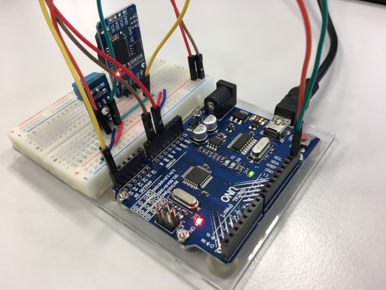
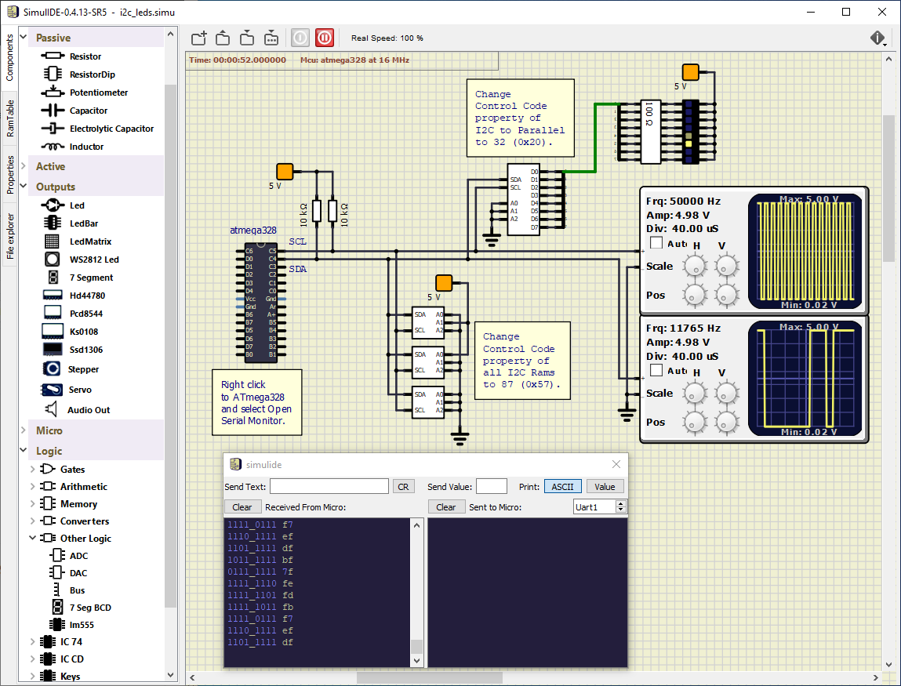
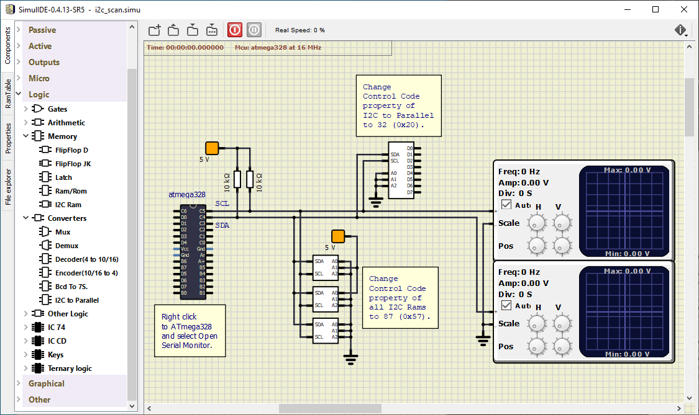

# Lab 7: Inter-Integrated Circuits (I2C)

<!--

-->

### Learning objectives

After completing this lab you will be able to:

* Understand the I2C communication
* Use functions from I2C library
* Perform data transfers between I2C devices and MCU

The purpose of the laboratory exercise is to understand serial synchronous communication using the I2C (Inter-Integrated Circuit) bus, as well as the structure of the address and data frame and the possibilities of communication using the internal TWI (Two Wire Interface) unit.

### Table of contents

* [Pre-Lab preparation](#preparation)
* [Part 1: Synchronize repositories and create a new project](#part1)
* [Part 2: I2C bus](#part2)
* [Part 3: I2C scanner](#part3)
* [Part 4: Communication with I2C devices](#part4)
* [Experiments on your own](#experiments)
* [Post-Lab report](#report)
* [References](#references)

<a name="preparation"></a>

## Pre-Lab preparation

1. Use schematic of the [Arduino Uno](https://oshwlab.com/tomas.fryza/arduino-shields) board and find out on which Arduino Uno pins the SDA and SCL signals are located.

2. Remind yourself, what the general structure of [I2C address and data frame](https://www.electronicshub.org/basics-i2c-communication/) is.

<a name="part1"></a>

## Part 1: Synchronize repositories and create a new project

1. Run Git Bash (Windows) of Terminal (Linux), navigate to your working directory, and update local repository.

   > **Help:** Useful bash and git commands are `cd` - Change working directory. `mkdir` - Create directory. `ls` - List information about files in the current directory. `pwd` - Print the name of the current working directory. `git status` - Get state of working directory and staging area. `git pull` - Update local repository and working folder.

2. Run Visual Studio Code and create a new PlatformIO project `lab7-i2c` for `Arduino Uno` board and change project location to your local repository folder `Documents/digital-electronics-2`.

3. IMPORTANT: Rename `LAB7-I2C > src > main.cpp` file to `main.c`, ie change the extension to `.c`.

4. Copy/paste [report template](https://raw.githubusercontent.com/tomas-fryza/digital-electronics-2/master/labs/07-i2c/report.md) to your `LAB7-I2C > test > README` file. Rename this file to `README.md`, ie add the extension `.md`.

<a name="part2"></a>

## Part 2: I2C bus

I2C (Inter-Integrated Circuit) is a serial protocol for two-wire interface to connect low-speed devices like microcontrollers, EEPROMs, A/D and D/A converters, I/O interfaces and other similar peripherals in embedded systems. It was invented by Philips and now it is used by almost all major IC manufacturers.

I2C uses only two wires: SCL (serial clock) and SDA (serial data). Both need to be pulled up with a resistor to +Vdd. There are also I2C level shifters which can be used to connect to two I2C buses with different voltages. On I2C bus, there is always one Master and one or several Slave devices. Each Slave device has a unique address [[2]](https://i2c.info/).


The initial I2C specifications defined maximum clock frequency of 100 kHz. This was later increased to 400 kHz as Fast mode. There is also a High speed mode which can go up to 3.4 MHz and there is also a 5 MHz ultra-fast mode.

In normal state both lines (SCL and SDA) are high. The communication is initiated by the master device. It generates the Start condition (S) followed by the address of the slave device (SLA). If the bit 0 of the address byte was set to 0 the master device will write to the slave device (SLA+W). Otherwise, the next byte will be read from the slave device (SLA+R). Each byte is supplemented by an ACK (low level) or NACK (high level) acknowledgment bit, which is always transmitted by the device receiving the previous byte.

The address byte is followed by one or more data bytes, where each contains 8 bits and is again terminated by ACK/NACK. Once all bytes are read or written the master device generates Stop condition (P). This means that the master device switches the SDA line from low voltage level to high voltage level before the SCL line switches from high to low [[3]](https://www.electronicshub.org/basics-i2c-communication/).


Note that, most I2C devices support repeated start condition. This means that before the communication ends with a stop condition, master device can repeat start condition with address byte and change the mode from writing to reading.

> ### Example of I2C communication
>
> **Question:** Let the following image shows several frames of I2C communication between ATmega328P and a slave device. What circuit is it and what information was sent over the bus?
>
> &nbsp;
> 
>
> **Answer:** This communication example contains a total of five frames. After the start condition, which is initiated by the master, the address frame is always sent. It contains a 7-bit address of the slave device, supplemented by information on whether the data will be written to the slave or read from it to the master. The ninth bit of the address frame is an acknowledgment provided by the receiving side.
>
> Here, the address is 184 (decimal), i.e. `101_1100-0` in binary including R/W=0. The slave address is therefore 101_1100 (0x5c) and master will write data to the slave. The slave has acknowledged the address reception, so that the communication can continue.
>
> According to the list of [I2C addresses](https://learn.adafruit.com/i2c-addresses/the-list) the device could be humidity/temp or pressure sensor. The signals were really recorded when communicating with the humidity and temperature sensor.
>
> The data frame always follows the address one and contains eight data bits from the MSB to the LSB and is again terminated by an acknowledgment from the receiving side. Here, number `2` was written to the sensor. According to the [DHT12 sensor manual](https://github.com/tomas-fryza/digital-electronics-2/blob/master/docs/dht12_manual.pdf), this is the address of register, to which the integer part of measured temperature is stored. (The following register contains its decimal part.)
>
> | **Register address** | **Description** |
> | :-: | :-- |
> | 0x00 | Humidity integer part |
> | 0x01 | Humidity decimal part |
> | 0x02 | Temperature integer part |
> | 0x03 | Temperature decimal part |
> | 0x04 | Checksum |
>
> After the repeated start, the same circuit address is sent on the I2C bus, but this time with the read bit R/W=1 (185, `1011100_1`). Subsequently, data frames are sent from the slave to the master until the last of them is confirmed by the NACK value. Then the master generates a stop condition on the bus and the communication is terminated.
>
> The communication in the picture therefore records the temperature transfer from the sensor, when the measured temperature is 25.3 degrees Celsius.
>
> | **Frame #** | **Description** |
> | :-: | :-- |
> | 1 | Address frame with SLA+W = 184 (0x5c<<1 + 0) |
> | 2 | Data frame sent to the Slave represents the ID of internal register |
> | 3 | Address frame with SLA+R = 185 (0x5c<<1 + 1) |
> | 4 | Data frame with integer part of temperature read from Slave |
> | 5 | Data frame with decimal part of temperature read from Slave |

<a name="part3"></a>

## Part 3: I2C scanner

The goal of this task is to create a program that will verify the presence of unknown devices connected to the I2C bus by sequentially trying all address combinations.

1. Copy/paste [template code](https://raw.githubusercontent.com/tomas-fryza/digital-electronics-2/master/labs/07-i2c/main.c) to `LAB7-I2C > src > main.c` source file.

2. Use your favorite file manager and copy `timer` and `uart` libraries from the previous lab to the proper locations within the `LAB7-IC2` project.

3. In PlatformIO project, create a new folder `LAB7-I2C > lib > twi`. Within this folder, create two new files `twi.c` and `twi.h`.

   1. Copy/paste [library source file](https://raw.githubusercontent.com/tomas-fryza/digital-electronics-2/master/labs/library/twi.c) to `twi.c`
   2. Copy/paste [header file](https://raw.githubusercontent.com/tomas-fryza/digital-electronics-2/master/labs/library/include/twi.h) to `twi.h`

   The final project structure should look like this:

   ```c
   ├── include
   │   └── timer.h
   ├── lib
   │   ├── twi
   │   │   ├── twi.c
   │   │   └── twi.h
   │   └── uart
   │       ├── uart.c
   │       └── uart.h
   └── src
       └── main.c
   ```

4. In the lab, we are using I2C/TWI library developed by Tomas Fryza according to Microchip Atmel ATmega16 and ATmega328P manuals. Use the [`twi.h`](../library/include/twi.h) header file and add input parameters and description of the following functions.

   | **Function name** | **Function parameters** | **Description** | **Example** |
   | :-- | :-- | :-- | :-- |
   | `twi_init` | None | Initialize TWI unit, enable internal pull-up resistors, and set SCL frequency | `twi_init();` |
   | `twi_start` |  | <br>&nbsp; | `twi_start(addr, TWI_READ);` |
   | `twi_write` |  | <br>&nbsp; |  |
   | `twi_read_ack` | <br>&nbsp; |  |  |
   | `twi_read_nack` | <br>&nbsp; |  |  |
   | `twi_stop` |  |  | `twi_stop();` |

5. Use breadboard and connect available I2C modules to Arduino Uno board, such as humidity/temperature [DHT12](https://github.com/tomas-fryza/digital-electronics-2/blob/master/docs/dht12_manual.pdf) digital sensor, combined module with [RTC DS3231](https://github.com/tomas-fryza/digital-electronics-2/blob/master/docs/ds3231_manual.pdf) (Real Time Clock) and [AT24C32](https://github.com/tomas-fryza/digital-electronics-2/blob/master/docs/at24c32_manual.pdf) EEPROM memory, or [GY-521 module](https://github.com/tomas-fryza/digital-electronics-2/blob/master/docs/mpu6050_datasheet.pdf) (MPU-6050 Microelectromechanical systems that features a 3-axis gyroscope, a 3-axis accelerometer, a digital motion processor (DMP), and a temperature sensor). Instead of external pull-up resistors on the SDA and SCL pins, the internal ones will be used.

   | **DHT12 pin** | **Arduino Uno pin** |
   | :-: | :-: |
   | + | 5V (or 3.3V) |
   | SDA | SDA |
   | - | GND |
   | SCL | SCL |

   | **[RTC+EEPROM pin](https://lastminuteengineers.com/ds3231-rtc-arduino-tutorial/)** | **Arduino Uno pin** |
   | :-- | :-: |
   | 32K (reference clock - output) | Not connected |
   | SQW (square-wave - output) | Not connected |
   | SCL | SCL |
   | SDA | SDA |
   | VCC | 5V (or 3.3V) |
   | GND | GND |

   | **GY-521 pin** | **Arduino Uno pin** |
   | :-: | :-: |
   | VCC | 5V (or 3.3V) |
   | GND | GND |
   | SCL | SCL |
   | SDA | SDA |
   | XDA | Not connected |
   | XCL | Not connected |
   | ADO | Not connected |
   | INT | Not connected |

6. Go through the `main.c` file and make sure you understand each line. Build and upload the code to Arduino Uno board. Use **PlatformIO: Serial Monitor** to receive values from Arduino board.

   Complete the Timer1 overflow handler and test all Slave addresses from the range 8 to 119. If Slave device address is detected, send the information via UART. What Slave addresses were detected?

<a name="part4"></a>

## Part 4: Communication with I2C devices

1. Program an application which reads data from humidity/temperature DHT12 sensor and sends them periodically via UART to Serial Monitor or PuTTY SSH Client. Use Timer/Counter1 with a suitable overflow time. Note that, according to the [DHT12 manual](../../docs/dht12_manual.pdf), the internal DHT12 data registers have the following structure.

   | **Register address** | **Description** |
   | :-: | :-- |
   | 0x00 | Humidity integer part |
   | 0x01 | Humidity decimal part |
   | 0x02 | Temperature integer part |
   | 0x03 | Temperature decimal part |
   | 0x04 | Checksum |

   Note that a structured variable in C can be used for read values.

   ```c
   /* Global variables --------------------------------------------------*/
   // Declaration of "air" variable with structure "Air_parameters_structure"
   struct Air_parameters_structure {
       uint8_t humid_int;
       uint8_t humid_dec;
       uint8_t temp_int;
       uint8_t temp_dec;
       uint8_t checksum;
   } air;

   ...
   air.humid_int = twi_read_ack();  // Store one byte to structured variable
   ```

2. (Optional) Find out how checksum byte value is calculated.

3. Program an application which reads data from RTC DS3231 chip and sends them periodically via UART to Serial Monitor or PuTTY SSH Client. Note that, according to the [DS3231 manual](../../docs/ds3231_manual.pdf), the internal RTC registers have the following structure.

   | **Address** | **Bit 7** | **Bits 6:4** | **Bits 3:0** |
   | :-: | :-: | :-: | :-: |
   | 0x00 | 0 | 10 Seconds | Seconds |
   | 0x01 | 0 | 10 Minutes | Minutes |
   | 0x02 | 0 | 12/24 AM/PM 10 Hour | Hour |
   | ... | ... | ... | ... |

4. (Optional) Verify the I2C communication with logic analyzer.

5. (Optional) Program an application which reads data from [GY-521 module](https://github.com/tomas-fryza/digital-electronics-2/blob/master/docs/mpu6050_datasheet.pdf). It consists of MPU-6050 Microelectromechanical systems that features a 3-axis gyroscope, a 3-axis accelerometer, a digital motion processor (DMP), and a temperature sensor.

6. When you finish, always synchronize the contents of your working folder with the local and remote versions of your repository. This way you are sure that you will not lose any of your changes. To do that, use **Source Control (Ctrl+Shift+G)** in Visual Studio Code or git commands.

   > **Help:** Useful git commands are `git status` - Get state of working directory and staging area. `git add` - Add new and modified files to the staging area. `git commit` - Record changes to the local repository. `git push` - Push changes to remote repository. `git pull` - Update local repository and working folder. Note that, a brief description of useful git commands can be found [here](https://github.com/tomas-fryza/digital-electronics-1/wiki/Useful-Git-commands) and detailed description of all commands is [here](https://github.com/joshnh/Git-Commands).

<a name="experiments"></a>

## Experiments on your own

1. Form the UART output of I2C scanner application to a hexadecimal table such as the following figure. Note that, the designation RA represents I2C addresses that are [reserved](https://www.pololu.com/file/download/UM10204.pdf?file_id=0J435) and cannot be used for slave circuits.

   ```Makefile
   Scan I2C-bus for slave devices:

         .0 .1 .2 .3 .4 .5 .6 .7 .8 .9 .a .b .c .d .e .f
   0x0.: RA RA RA RA RA RA RA RA -- -- -- -- -- -- -- --
   0x1.: -- -- -- -- -- -- -- -- -- -- -- -- -- -- -- --
   0x2.: -- -- -- -- -- -- -- -- -- -- -- -- -- -- -- --
   0x3.: -- -- -- -- -- -- -- -- -- -- -- -- -- -- -- --
   0x4.: -- -- -- -- -- -- -- -- -- -- -- -- -- -- -- --
   0x5.: -- -- -- -- -- -- -- 57 -- -- -- -- -- -- -- --
   0x6.: -- -- -- -- -- -- -- -- -- -- -- -- -- -- -- --
   0x7.: -- -- -- -- -- -- -- -- RA RA RA RA RA RA RA RA
   
   Number of detected devices: 1
   ```

2. Program functions that will be able to read only one value from the RTC DS3231 at a time.

   | **Function name** | **Function parameters** | **Description** | **Example** |
   | :-- | :-- | :-- | :-- |
   | `rtc_read_seconds` | None | Read seconds from RTC | `rtc.secs = rtc_read_seconds();` |
   | `rtc_read_minutes` | None | Read minutes from RTC | `rtc.mins = rtc_read_minutes();` |
   | `rtc_read_hours` | None | Read hours from RTC | `rtc.hours = rtc_read_hours();` |

3. Program the functions that will be able to save the current time values to the RTC DS3231.

4. In the SimulIDE application, create the circuit with eight active-low LEDs connected to I2C to Parallel expander. You can use individual components (ie. 8 resistors and 8 LEDs) or single **Passive > ResistorDip** and **Outputs > LedBar** according to the following figure. Several signals can form a bus **Logic > Other Logic > Bus**, as well.

   

   Create an application that sequentially turns on one of the eight LEDs. ie first LED0, then LED1 and finally LED7, then start again from the beginning. Use Timer/Counter1 and change the value every 262 ms. Send the status of the LEDs to the UART. Try to complement the LED controls according to the Knight Rider style, ie light the LEDs in one direction and then in the opposite one.

5. In the SimulIDE application, use the following components: I2C Ram (**Components > Logic > Memory > I2C Ram**), I2C to Parallel (**Components > Logic > Converters > I2C to Parallel**) and create a schematic according to the following figure. Also, change **Control Code** property of all I2C devices. These codes represent the I2C addresses of the Slave circuits. Pins A2, A1, A0 allow you to specify part of the device address. Thus, up to 8 (2^3 = 8) identical devices can be connected and it will be possible to distinguish them. External pull-up resistors on SDA and SCL signals must be used for correct simulation.

   

   Program an application that communicates with memory modules using the I2C bus. Store random data in the first ten address positions of the first and second memory modules. Then copy 5 values from the first memory to the third and another 5 values from the second memory to the third one. Send the first ten values from each memory module to the UART.

<a name="report"></a>

## Post-Lab report

*Complete all parts of `LAB7-I2C > test > README.md` file (see Part 1.4) in Czech, Slovak, or English, push it to your GitHub repository, and submit a link to this file via [BUT e-learning](https://moodle.vutbr.cz/). The deadline for submitting the task is the day before the next computer exercise.*

*Vypracujte všechny části ze souboru `LAB7-I2C > test > README.md` (viz Část 1.4) v českém, slovenském, nebo anglickém jazyce, uložte je na váš GitHub repozitář a odevzdejte link na tento soubor prostřednictvím [e-learningu VUT](https://moodle.vutbr.cz/). Termín odevzdání úkolu je den před dalším počítačovým cvičením.*

<a name="references"></a>

## References

1. Tomas Fryza. [Schematic of Arduino Uno](https://oshwlab.com/tomas.fryza/arduino-shields) board

2. Ezoic. [I2C Info - I2C Bus, Interface and Protocol](https://i2c.info/)

3. Electronicshub.org. [Basics of I2C Communication | Hardware, Data Transfer, Configuration](https://www.electronicshub.org/basics-i2c-communication/)

4. Adafruit. [List of I2C addresses](https://learn.adafruit.com/i2c-addresses/the-list)

5. Aosong. [Digital temperature DHT12](../../docs/dht12_manual.pdf)

6. NXP. [I2C-bus specification and user manual](https://www.pololu.com/file/download/UM10204.pdf?file_id=0J435)

7. Maxim Integrated. [DS3231, Extremely accurate I2C-Integrated RTC/TCXO/Crystal](../../docs/ds3231_manual.pdf)

8. LastMinuteEngineers. [Interface DS3231 Precision RTC Module with Arduino](https://lastminuteengineers.com/ds3231-rtc-arduino-tutorial/)

8. Tomas Fryza. [Useful Git commands](https://github.com/tomas-fryza/digital-electronics-2/wiki/Useful-Git-commands)

